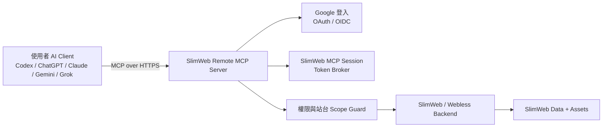

# SlimWeb-MCP

SlimWeb-MCP 是 SlimWeb / Webless 電商後台的 Remote MCP 閘道。主要目標是讓使用者透過自己的 AI Client，例如 Codex、ChatGPT、Claude、Gemini、Grok，直接操作 SlimWeb 後台，而不是被迫學習 SlimWeb 內部的頁面編輯邏輯、資料欄位或管理流程。

這個 repo 是 MCP 架構與實作的入口。SlimWeb / Webless 仍然是商品、訂單、頁面、素材、設定、會員與權限的 source of truth。

## 目標

- 提供 SlimWeb 後台可用的 Remote MCP Server。
- 透過 Google 登入驗證使用者身份。
- 讓每一次 MCP tool 呼叫都綁定使用者、帳號、站台與權限。
- 以明確的 MCP tools 開放常見電商後台操作。
- 讓 AI Client 只透過 tools 操作 SlimWeb，不直接碰資料庫、Storage 或內部後台路由。
- 將這份 README 當作持續維護的 tool contract。每新增或修改 MCP tool，都必須同步更新本文件。

## 非目標

- 不取代 SlimWeb / Webless 後端。
- 不另存一份商品、訂單、頁面或會員資料。
- 不繞過 SlimWeb 原本的角色與權限檢查。
- 不綁定單一 AI Client。
- 不提供 raw SQL、raw database、raw storage credential 類型的 MCP tool。
- 不把整個後台 UI 自動化暴露成不受控的瀏覽器操作。

## 架構總覽



Remote MCP Server 是 SlimWeb 前方的受控 adapter。AI Client 不直接連資料庫、Cloud Storage 或內部 admin route。Client 先完成 Google 登入，取得被限制範圍的 MCP session，再透過 tool discovery 得到可用工具，最後用 tools 操作 SlimWeb。

## 核心元件

### Remote MCP Server

Remote MCP Server 是 AI Client 對外連線的入口。

職責：

- 以 HTTPS 提供 MCP discovery 與 tool invocation。
- 對需要保護的 tools 強制要求登入。
- 驗證 tool input schema。
- 將 MCP request 轉成 SlimWeb 可執行的 application service 或 API 呼叫。
- 將 SlimWeb response 正規化成穩定的 MCP tool output。
- 回傳明確錯誤，例如未登入、權限不足、驗證失敗、需要確認、SlimWeb upstream error。

### Google 登入

Google 登入是 Remote MCP 的主要身份驗證方式。

職責：

- 透過 OAuth / OIDC 驗證 Google identity。
- 將 Google account 對應到 SlimWeb user。
- 建立或更新 SlimWeb MCP session。
- 將 session scope 限制在使用者可操作的 account、site、role、permissions。

預期登入流程：

1. AI Client 連到 SlimWeb Remote MCP Server。
2. 如果沒有有效 MCP session，server 回傳 authentication required 與 login URL。
3. 使用者在瀏覽器完成 Google 登入。
4. SlimWeb 驗證 Google identity，並綁定 SlimWeb user。
5. MCP Server 建立 scoped MCP session。
6. AI Client 重新進行 tool discovery 或 tool invocation。

### Session 與 Token Broker

Session layer 負責把 Google 驗證後的身份轉成 SlimWeb 可以接受的 MCP access。

規則：

- MCP session 必須是短效或可安全 refresh。
- token 不可包含 SlimWeb 內部 secret。
- session claims 至少要包含 `user_id`、`account_id`、可操作的 `site_ids`、`role`、`permissions`。
- 每次 tool 呼叫都要重新檢查權限，不可只依賴 discovery 時的結果。

### 權限與站台 Scope Guard

每個 tool 都必須在明確 scope 內執行。

最低 scope 欄位：

- `account_id`
- `site_id`
- `user_id`
- `role`
- `permissions`

以下情況必須拒絕 request：

- 使用者未登入。
- MCP session 已過期。
- 指定站台不屬於該 account。
- 使用者 role 沒有所需 permission。
- tool 嘗試修改 active site 以外的資料。
- 高風險操作需要 confirmation，但 request 沒有 confirmation token。

### SlimWeb Backend Adapter

Adapter 是 MCP Server 與 SlimWeb / Webless 後端之間的唯一連接層。

職責：

- 將 MCP tool request 對應到 SlimWeb application service 或 HTTP API。
- 優先重用 SlimWeb 現有 business rule，不在 MCP Server 重寫一份規則。
- 隔離 SlimWeb 內部 controller、model、route 的變化。
- 對外提供穩定 output，讓 AI Client 可以可靠推理。
- 記錄 tool execution audit log，方便追蹤與客服支援。

## 資料流

### Site Selection 與歧義處理

使用者帳號底下可能有多個 SlimWeb site。AI Client 不可在無法判斷目標網站時自行猜測。

規則：

- 使用者登入後，AI 應先呼叫 `slimweb.sites.list` 取得可操作網站。
- 若只有一個 site，可自動選定該 site。
- 若有多個 site，且使用者沒有明確說出網站名稱、網域、site ID 或足以唯一識別的線索，AI 必須向使用者確認要操作哪個網站。
- 若使用者描述能比對到多個 site，AI 必須列出候選網站並要求使用者選擇。
- Write tools 必須帶入 active site scope；沒有 active site 時，server 回傳 `SITE_SCOPE_REQUIRED`。
- AI Client 不需要知道 SlimWeb 的目錄結構，只需要透過 tools 查詢資料、選擇目標、提交結構化操作。

建議 AI 操作順序：

1. `slimweb.auth.status`
2. `slimweb.sites.list`
3. `slimweb.site.select`，或在無法唯一判斷時先問使用者
4. 依任務組合 read tools 與 write tools

### Tool Discovery

1. AI Client 連到 Remote MCP endpoint。
2. MCP Server 檢查 session。
3. MCP Server 根據使用者 role、permissions、active site 回傳可用 tools。
4. AI Client 將 tools 提供給模型或使用者操作。

### Read Tool

1. Client 呼叫 read-only tool，例如列出商品、類別、訂單或優惠。
2. MCP Server 驗證 session 與 site scope。
3. Scope Guard 檢查 read permission。
4. Adapter 呼叫 SlimWeb。
5. MCP Server 回傳正規化結果。

### Write Tool

1. Client 呼叫 write tool，例如更新商品文案、替換商品圖片、調整訂單狀態或建立優惠。
2. MCP Server 驗證 input schema。
3. Scope Guard 檢查 write permission。
4. 高影響操作要求 confirmation。
5. Adapter 呼叫 SlimWeb。
6. MCP Server 回傳更新後摘要、warnings、audit ID。

## 初始 MCP Tools 規劃

第一階段先建立小而安全的 tool surface。每個 tool 都要具備權限檢查、input validation、錯誤處理、audit log 與文件更新，再進入可用狀態。

版型與頁面 tools 先不在本階段定義，之後獨立補上。

| Tool | 狀態 | 權限 | 用途 |
| --- | --- | --- | --- |
| `slimweb.auth.status` | Available | authenticated user | 回傳登入狀態、使用者摘要、目前 account。 |
| `slimweb.sites.list` | Available | account read | 列出使用者可操作的 SlimWeb sites。 |
| `slimweb.site.select` | Available | account read | 驗證並回傳 AI 後續 tool 呼叫要操作的 site。 |
| `slimweb.dashboard.summary` | Planned | dashboard read | 讀取 KPI、最新訂單、最新會員、低庫存提醒等後台首頁摘要。 |
| `slimweb.settings.get` | Planned | settings read | 讀取網站狀態、國別、商品載入方式、允許退貨天數等基本設定。 |
| `slimweb.settings.update` | Planned | settings write | 更新允許由 MCP 修改的基本設定欄位。 |
| `slimweb.admins.list` | Planned | admin read | 列出站台管理員與權限摘要。 |
| `slimweb.admins.upsert` | Planned | admin write | 新增或更新站台管理員與權限。 |
| `slimweb.categories.list` | Planned | product read | 列出商品分類，回答「目前有哪些類別」這類問題。 |
| `slimweb.categories.create` | Planned | product write | 新增商品分類。 |
| `slimweb.categories.update` | Planned | product write | 更新分類名稱、排序、啟用狀態或父層。 |
| `slimweb.products.list` | Planned | product read | 依狀態、分類、關鍵字與分頁列出商品。 |
| `slimweb.products.get` | Planned | product read | 讀取單一商品，包含規格、圖片、價格、庫存、SEO 欄位。 |
| `slimweb.products.update` | Planned | product write | 透過 SlimWeb validation 更新允許修改的商品欄位。 |
| `slimweb.products.images.replace` | Planned | product write + asset write | 替換商品主圖、說明圖或規格圖；必須提供替換圖片。 |
| `slimweb.products.variants.update` | Planned | product write | 更新商品規格、規格價格、特價與庫存。 |
| `slimweb.products.quantity_discounts.update` | Planned | product write | 更新商品數量折扣。 |
| `slimweb.products.import.analyze` | Planned | product write | 分析匯入資料，回傳可建立或更新的商品草稿。 |
| `slimweb.products.import.commit` | Planned | product write | 將已確認的匯入草稿寫入 SlimWeb。 |
| `slimweb.orders.list` | Planned | order read | 依狀態、日期區間、關鍵字與分頁列出訂單。 |
| `slimweb.orders.get` | Planned | order read | 讀取單一訂單，包含客戶、品項、付款、物流與歷史紀錄。 |
| `slimweb.orders.status.update` | Planned | order write | 更新訂單狀態，例如確認、取消、退貨中、已退貨。 |
| `slimweb.returns.list` | Planned | order read | 列出退貨中或已退貨訂單。 |
| `slimweb.returns.confirm` | Planned | order write | 確認退貨，執行 SlimWeb 既有消費總額調整規則。 |
| `slimweb.members.list` | Planned | member read | 列出會員與篩選會員資料。 |
| `slimweb.members.get` | Planned | member read | 讀取單一會員摘要、訂單摘要、優惠券與等級。 |
| `slimweb.members.coupons.issue` | Planned | member write + promotion write | 手動發券給指定會員。 |
| `slimweb.coupon_templates.list` | Planned | promotion read | 列出優惠券模板。 |
| `slimweb.coupon_templates.upsert` | Planned | promotion write | 新增或更新優惠券模板。 |
| `slimweb.discount_codes.list` | Planned | promotion read | 列出折扣碼。 |
| `slimweb.discount_codes.upsert` | Planned | promotion write | 新增或更新折扣碼。 |
| `slimweb.member_tiers.list` | Planned | promotion read | 列出會員等級與門檻。 |
| `slimweb.member_tiers.upsert` | Planned | promotion write | 新增或更新會員等級。 |
| `slimweb.threshold_gifts.list` | Planned | promotion read | 列出滿額禮。 |
| `slimweb.threshold_gifts.upsert` | Planned | promotion write | 新增或更新滿額禮。 |
| `slimweb.product_add_ons.list` | Planned | promotion read | 列出單品加購規則。 |
| `slimweb.product_add_ons.upsert` | Planned | promotion write | 新增或更新單品加購規則。 |
| `slimweb.articles.list` | Planned | content read | 列出文章。 |
| `slimweb.articles.upsert` | Planned | content write | 新增或更新文章內容。 |
| `slimweb.faqs.list` | Planned | content read | 列出 FAQ。 |
| `slimweb.faqs.upsert` | Planned | content write | 新增或更新 FAQ。 |
| `slimweb.customer_service.logs.list` | Planned | customer service read | 查詢 AI 客服紀錄。 |
| `slimweb.customer_service.settings.get` | Planned | customer service read | 讀取 AI 客服設定摘要。 |
| `slimweb.customer_service.settings.update` | Planned | customer service write | 更新 AI 客服設定。 |
| `slimweb.exports.create` | Planned | export read | 建立會員、訂單或退貨匯出檔。 |
| `slimweb.assets.upload` | Available | asset write | 只有當 AI flow 明確需要保存可重用素材時才寫入 asset。 |
| `slimweb.pages.get_home_content` | Available | content read | 讀取首頁目前儲存在 Webless template storage 的 body/content。 |
| `slimweb.pages.update_home_content` | Available | content write | 替換首頁 body/content；禁止直接寫入 script/link/iframe 與 inline event handler。 |
| `slimweb.preview.get_page_url` | Available | content read | 回傳指定 site、page、theme 的預覽 URL，供 AI 自行截圖與檢查。 |
| `slimweb.external_assets.list` | Planned | asset read | 列出站台、版型或頁面層級引用的外部 CSS / JS。 |
| `slimweb.external_assets.upsert` | Planned | asset write + content write | 新增或更新外部 CSS / JS 引用；AI 必須提供 URL 與用途。 |
| `slimweb.external_assets.delete` | Planned | asset write + content write | 停用或刪除外部 CSS / JS 引用。 |
| `slimweb.external_assets.reorder` | Planned | asset write + content write | 調整外部 CSS / JS 載入順序。 |
| `slimweb.audit.list` | Planned | audit read | 列出近期 MCP tool execution 紀錄。 |

## Tool 文件維護規範

每新增或修改一個 tool，都必須在同一個 PR 更新本 README。格式如下：

```md
### `tool.name`

- 狀態:
- 權限:
- Scope:
- 用途:
- Input:
- Output:
- Side effects:
- 是否需要 confirmation:
- 錯誤情境:
- Audit fields:
```

規則：

- 實作 tool 的 PR 必須同步更新文件。
- experimental tool 要清楚標示。
- tool 尚未進入 MCP discovery 前，不可標成可用。
- 任何會修改客戶可見內容的 input，都要寫明 validation 與 rollback / recovery 行為。
- 任何會處理圖片的 tool，都要寫明圖片是 reference-only，還是會保存成 reusable asset。

## Tool Contracts

### 共通 Tool Rules

- 所有 tools 預設都需要有效 Google 登入與 MCP session。
- 除 `slimweb.auth.status`、`slimweb.sites.list` 之外，tools 都需要 active site。
- 若 active site 無法從使用者語意唯一判斷，AI 必須先問使用者，不可猜測。
- Read tools 應回傳 stable IDs，讓 AI 後續 write tools 能精準指定目標。
- Write tools 不接受模糊目標，例如「第一個商品」；AI 必須先用 read tool 取得候選，再讓使用者或語意唯一指定。
- 需要圖片的 tools 必須明確收到圖片附件、可下載 image URL、或前一步 `slimweb.assets.upload` 回傳的 `asset_id`。
- 外部 CSS / JS 不可直接寫入頁面內容、文章內容或版型內容；AI 必須使用 `slimweb.external_assets.*` tools 以結構化 URL 管理。
- Write tools 應拒絕未經 allowlist 的 `<script>`、`<link rel="stylesheet">`、inline event handler 與可執行片段，除非該 tool 明確標示支援且通過安全驗證。
- AI 不需要知道 SlimWeb 檔案目錄或後端 route，只需依 tool contract 使用 tools。

### `slimweb.auth.status`

- 狀態: Available
- 權限: authenticated user
- Scope: user session
- 用途: 回傳目前登入與 scope 狀態。
- Input: none
- Output: login status、user summary、account summary、active site summary、available site count、session expiry
- Side effects: none
- 是否需要 confirmation: no
- 錯誤情境: expired session、invalid token
- Audit fields: request ID、user ID、session ID

### `slimweb.sites.list`

- 狀態: Available
- 權限: account read
- Scope: authenticated account
- 用途: 列出使用者可透過 MCP 操作的 sites。
- Input: optional pagination、keyword filter
- Output: site IDs、names、domains、status、role、permission summary
- Side effects: none
- 是否需要 confirmation: no
- 錯誤情境: unauthorized、no linked SlimWeb account
- Audit fields: request ID、user ID、account ID

### `slimweb.site.select`

- 狀態: Available
- 權限: account read
- Scope: authenticated account
- 用途: 驗證使用者可操作指定 site，並回傳 site summary 與可用 theme/page scheme。AI Client 不可在多站台歧義時自行猜測。
- Input: `site_id`
- Output: selected site summary、themes、mutation scope hints
- Side effects: none；目前不把 active site 寫入 session，write tools 仍必須明確帶 `site_id`
- 是否需要 confirmation: no
- 錯誤情境: site not found、site not accessible
- Audit fields: request ID、user ID、account ID、site ID

### `slimweb.dashboard.summary`

- 狀態: Planned
- 權限: dashboard read
- Scope: active site
- 用途: 回傳後台首頁摘要，讓 AI 快速理解目前站台狀況。
- Input: optional date range
- Output: KPI summary、latest orders、latest members、low stock products、traffic summary if available
- Side effects: none
- 是否需要 confirmation: no
- 錯誤情境: missing active site、permission denied
- Audit fields: request ID、user ID、account ID、site ID

### `slimweb.settings.get`

- 狀態: Planned
- 權限: settings read
- Scope: active site
- 用途: 讀取 AI 後台操作需要的站台基本設定。
- Input: optional fields list
- Output: site status、country、product loading mode、return days allowed、editable field hints
- Side effects: none
- 是否需要 confirmation: no
- 錯誤情境: missing active site、permission denied
- Audit fields: request ID、user ID、account ID、site ID

### `slimweb.settings.update`

- 狀態: Planned
- 權限: settings write
- Scope: active site
- 用途: 更新允許 MCP 修改的基本設定。
- Input: patch object，僅允許 allowlist 欄位，例如 site status、country、product loading mode、return days allowed
- Output: updated settings summary、changed fields、warnings、audit ID
- Side effects: modifies site settings
- 是否需要 confirmation: yes for disabling site、changing return policy、or settings that affect storefront behavior
- 錯誤情境: validation failed、permission denied、unsupported field、conflict
- Audit fields: request ID、user ID、account ID、site ID、changed fields

### `slimweb.admins.list`

- 狀態: Planned
- 權限: admin read
- Scope: active site
- 用途: 列出站台管理員與權限摘要，讓 AI 在權限問題上能先查清楚現況。
- Input: optional keyword、role、pagination
- Output: admin summaries、roles、permission summary、status、last updated time
- Side effects: none
- 是否需要 confirmation: no
- 錯誤情境: missing active site、permission denied
- Audit fields: request ID、user ID、account ID、site ID

### `slimweb.admins.upsert`

- 狀態: Planned
- 權限: admin write
- Scope: active site
- 用途: 新增或更新站台管理員與權限。
- Input: optional admin ID、email or user identifier、role、permissions、status
- Output: admin summary、changed permissions、audit ID
- Side effects: creates or modifies admin access
- 是否需要 confirmation: yes
- 錯誤情境: validation failed、admin not found、duplicate admin、cannot modify owner、permission denied、conflict
- Audit fields: request ID、user ID、account ID、site ID、target admin ID、changed permissions

### `slimweb.categories.list`

- 狀態: Planned
- 權限: product read
- Scope: active site
- 用途: 列出商品分類，支援「目前商品有哪些類別？」這類問題。
- Input: optional status、keyword、include product counts
- Output: category IDs、names、parent IDs、sort order、status、product counts
- Side effects: none
- 是否需要 confirmation: no
- 錯誤情境: missing active site、permission denied
- Audit fields: request ID、user ID、account ID、site ID

### `slimweb.categories.create`

- 狀態: Planned
- 權限: product write
- Scope: active site
- 用途: 新增商品分類。
- Input: name、optional parent category ID、status、sort order
- Output: created category summary、audit ID
- Side effects: creates category
- 是否需要 confirmation: no, unless category will be immediately visible on storefront
- 錯誤情境: validation failed、duplicate name、parent not found、permission denied
- Audit fields: request ID、user ID、account ID、site ID、category ID

### `slimweb.categories.update`

- 狀態: Planned
- 權限: product write
- Scope: active site
- 用途: 更新分類名稱、排序、啟用狀態或父層。
- Input: category ID、patch object
- Output: updated category summary、changed fields、audit ID
- Side effects: modifies category
- 是否需要 confirmation: yes for disabling category、moving category with products、or changing storefront-visible navigation
- 錯誤情境: validation failed、category not found、cycle detected、permission denied、conflict
- Audit fields: request ID、user ID、account ID、site ID、category ID、changed fields

### `slimweb.products.list`

- 狀態: Planned
- 權限: product read
- Scope: active site
- 用途: 列出商品，讓 AI 可協助搜尋、審查與編輯前確認。
- Input: status、category、keyword、pagination、sort
- Output: product summaries、stable IDs、editable field hints
- Side effects: none
- 是否需要 confirmation: no
- 錯誤情境: missing active site、unauthorized
- Audit fields: request ID、user ID、account ID、site ID

### `slimweb.products.get`

- 狀態: Planned
- 權限: product read
- Scope: active site
- 用途: 讀取單一商品完整可編輯摘要，讓 AI 在修改前知道目前資料。
- Input: product ID
- Output: product fields、categories、primary images、content images、videos、variants、quantity discounts、add-ons、editable field hints
- Side effects: none
- 是否需要 confirmation: no
- 錯誤情境: product not found、permission denied
- Audit fields: request ID、user ID、account ID、site ID、product ID

### `slimweb.products.update`

- 狀態: Planned
- 權限: product write
- Scope: active site
- 用途: 透過 SlimWeb validation 更新商品欄位。
- Input: product ID、patch object、optional client note
- Output: updated product summary、changed fields、warnings、audit ID
- Side effects: modifies product data
- 是否需要 confirmation: price、inventory、publication status、破壞性客戶可見內容修改都需要
- 錯誤情境: validation failed、conflict、unauthorized、product not found
- Audit fields: request ID、user ID、account ID、site ID、product ID、changed fields

### `slimweb.products.images.replace`

- 狀態: Planned
- 權限: product write + asset write
- Scope: active site
- 用途: 替換商品圖片，例如「把商品 xxx 的第一張圖換成這張」。
- Input: product ID、image target、replacement image、optional alt text、optional client note
- Input 條件:
  - `image target` 必須指定 `primary_image`、`content_image` 或 `variant_image`
  - 若指定第一張主圖，使用 `image target = primary_image` 與 `position = 1`
  - `replacement image` 必須是圖片附件、可下載 image URL、或 `asset_id`
  - 若使用者只說商品名稱，AI 必須先呼叫 `slimweb.products.list` 或 `slimweb.products.get` 找到唯一 `product_id`
- Output: updated product image summary、old image reference、new image reference、warnings、audit ID
- Side effects: uploads or links image、updates product image list、may affect storefront
- 是否需要 confirmation: yes when replacing customer-facing image、removing old image、or product match is based on fuzzy search
- 錯誤情境: product not found、image missing、unsupported file type、file too large、target image not found、permission denied、validation failed
- Audit fields: request ID、user ID、account ID、site ID、product ID、image target、old image ID、new image ID

### `slimweb.products.variants.update`

- 狀態: Planned
- 權限: product write
- Scope: active site
- 用途: 更新商品規格模式、規格名稱、規格價格、特價與庫存。
- Input: product ID、variant mode、variants patch、optional client note
- Output: updated variants summary、stock sync result、warnings、audit ID
- Side effects: modifies product variants and may sync product total stock
- 是否需要 confirmation: yes for price changes、stock changes、or switching variant mode
- 錯誤情境: product not found、invalid variant mode、validation failed、conflict、permission denied
- Audit fields: request ID、user ID、account ID、site ID、product ID、changed variants

### `slimweb.products.quantity_discounts.update`

- 狀態: Planned
- 權限: product write
- Scope: active site
- 用途: 更新商品數量折扣。
- Input: product ID、quantity discount rules
- Output: updated discount rules、warnings、audit ID
- Side effects: modifies product pricing behavior
- 是否需要 confirmation: yes
- 錯誤情境: product not found、validation failed、overlapping rules、permission denied
- Audit fields: request ID、user ID、account ID、site ID、product ID

### `slimweb.products.import.analyze`

- 狀態: Planned
- 權限: product write
- Scope: active site
- 用途: 分析使用者提供的商品匯入資料，回傳可確認的商品草稿。
- Input: source file or structured rows、default status、optional category mapping、optional image handling policy
- Output: import draft ID、detected products、category candidates、validation warnings、required confirmations
- Side effects: creates temporary import draft only
- 是否需要 confirmation: no
- 錯誤情境: unsupported file type、parse failed、validation failed、permission denied
- Audit fields: request ID、user ID、account ID、site ID、import draft ID

### `slimweb.products.import.commit`

- 狀態: Planned
- 權限: product write
- Scope: active site
- 用途: 將已分析且使用者確認的商品匯入草稿寫入 SlimWeb。
- Input: import draft ID、confirmed product IDs or all、conflict strategy
- Output: created products、updated products、skipped rows、warnings、audit ID
- Side effects: creates or updates products、categories、images、variants depending on confirmed draft
- 是否需要 confirmation: yes
- 錯誤情境: import draft not found、expired draft、validation failed、conflict、permission denied
- Audit fields: request ID、user ID、account ID、site ID、import draft ID

### `slimweb.orders.list`

- 狀態: Planned
- 權限: order read
- Scope: active site
- 用途: 依狀態、日期區間、關鍵字與分頁列出訂單。
- Input: status、date range、keyword、pagination、sort
- Output: order summaries、customer summary、grand total、status、created time、return flags
- Side effects: none
- 是否需要 confirmation: no
- 錯誤情境: missing active site、permission denied、invalid filter
- Audit fields: request ID、user ID、account ID、site ID

### `slimweb.orders.get`

- 狀態: Planned
- 權限: order read
- Scope: active site
- 用途: 讀取單一訂單完整摘要。
- Input: order ID
- Output: order detail、items、image snapshots、customer、payment、shipping、status logs、return eligibility
- Side effects: none
- 是否需要 confirmation: no
- 錯誤情境: order not found、permission denied
- Audit fields: request ID、user ID、account ID、site ID、order ID

### `slimweb.orders.status.update`

- 狀態: Planned
- 權限: order write
- Scope: active site
- 用途: 更新訂單狀態，例如待處理、已完成、退貨中、已退貨。
- Input: order ID、target status、reason、optional client note
- Output: updated order summary、status log、member total spent adjustment if any、audit ID
- Side effects: modifies order status and may update member total spent amount according to SlimWeb rules
- 是否需要 confirmation: yes
- 錯誤情境: invalid transition、order not found、permission denied、conflict
- Audit fields: request ID、user ID、account ID、site ID、order ID、old status、new status

### `slimweb.returns.list`

- 狀態: Planned
- 權限: order read
- Scope: active site
- 用途: 列出退貨中與已退貨訂單。
- Input: status、date range、keyword、pagination
- Output: return order summaries、customer summary、grand total、return status、confirmed time
- Side effects: none
- 是否需要 confirmation: no
- 錯誤情境: missing active site、permission denied
- Audit fields: request ID、user ID、account ID、site ID

### `slimweb.returns.confirm`

- 狀態: Planned
- 權限: order write
- Scope: active site
- 用途: 確認退貨，執行 `returning -> returned`，並套用 SlimWeb 會員消費總額調整規則。
- Input: order ID、reason、optional client note
- Output: updated return summary、member total spent adjustment、audit ID
- Side effects: changes order status、may reduce member total spent amount
- 是否需要 confirmation: yes
- 錯誤情境: order not found、order not returning、permission denied、conflict
- Audit fields: request ID、user ID、account ID、site ID、order ID

### `slimweb.members.list`

- 狀態: Planned
- 權限: member read
- Scope: active site
- 用途: 列出會員，支援客服、行銷與訂單查詢。
- Input: keyword、tier、created date range、pagination、sort
- Output: member summaries、tier、total spent、coupon count、latest order summary
- Side effects: none
- 是否需要 confirmation: no
- 錯誤情境: missing active site、permission denied
- Audit fields: request ID、user ID、account ID、site ID

### `slimweb.members.get`

- 狀態: Planned
- 權限: member read
- Scope: active site
- 用途: 讀取單一會員摘要。
- Input: member ID
- Output: member profile summary、tier、total spent、orders summary、available coupons
- Side effects: none
- 是否需要 confirmation: no
- 錯誤情境: member not found、permission denied
- Audit fields: request ID、user ID、account ID、site ID、member ID

### `slimweb.members.coupons.issue`

- 狀態: Planned
- 權限: member write + promotion write
- Scope: active site
- 用途: 手動發券給指定會員。
- Input: member ID、coupon template ID、quantity、optional expiry override、reason
- Output: issued coupon summary、member coupon count、audit ID
- Side effects: creates member coupon records
- 是否需要 confirmation: yes
- 錯誤情境: member not found、coupon template not found、inactive template、validation failed、permission denied
- Audit fields: request ID、user ID、account ID、site ID、member ID、coupon template ID、quantity

### `slimweb.coupon_templates.list`

- 狀態: Planned
- 權限: promotion read
- Scope: active site
- 用途: 列出優惠券模板。
- Input: status、issue trigger、keyword、pagination
- Output: coupon template summaries、validity rules、threshold amount、active status
- Side effects: none
- 是否需要 confirmation: no
- 錯誤情境: missing active site、permission denied
- Audit fields: request ID、user ID、account ID、site ID

### `slimweb.coupon_templates.upsert`

- 狀態: Planned
- 權限: promotion write
- Scope: active site
- 用途: 新增或更新優惠券模板。
- Input: optional coupon template ID、name、discount rule、issue trigger、validity rule、threshold amount、active status
- Output: coupon template summary、changed fields、audit ID
- Side effects: creates or modifies coupon template
- 是否需要 confirmation: yes when activating, changing discount value, or changing validity rule
- 錯誤情境: validation failed、template not found、permission denied、conflict
- Audit fields: request ID、user ID、account ID、site ID、coupon template ID、changed fields

### `slimweb.discount_codes.list`

- 狀態: Planned
- 權限: promotion read
- Scope: active site
- 用途: 列出折扣碼。
- Input: status、keyword、platform、pagination
- Output: discount code summaries、ratio、platform、active status、usage summary
- Side effects: none
- 是否需要 confirmation: no
- 錯誤情境: missing active site、permission denied
- Audit fields: request ID、user ID、account ID、site ID

### `slimweb.discount_codes.upsert`

- 狀態: Planned
- 權限: promotion write
- Scope: active site
- 用途: 新增或更新折扣碼。
- Input: optional discount code ID、code、ratio or amount、platform、active status、validity rule
- Output: discount code summary、changed fields、audit ID
- Side effects: creates or modifies discount code
- 是否需要 confirmation: yes when activating or changing discount value
- 錯誤情境: duplicate code、validation failed、discount code not found、permission denied、conflict
- Audit fields: request ID、user ID、account ID、site ID、discount code ID、changed fields

### `slimweb.member_tiers.list`

- 狀態: Planned
- 權限: promotion read
- Scope: active site
- 用途: 列出會員等級、門檻、折抵百分比與各等級會員數。
- Input: none or pagination
- Output: member tier summaries、thresholds、discount percentages、member counts
- Side effects: none
- 是否需要 confirmation: no
- 錯誤情境: missing active site、permission denied
- Audit fields: request ID、user ID、account ID、site ID

### `slimweb.member_tiers.upsert`

- 狀態: Planned
- 權限: promotion write
- Scope: active site
- 用途: 新增或更新會員等級。
- Input: optional tier ID、name、threshold amount、discount percentage、sort order
- Output: member tier summary、affected members estimate if available、audit ID
- Side effects: creates or modifies member tier and may affect future cart discount behavior
- 是否需要 confirmation: yes
- 錯誤情境: validation failed、tier not found、overlapping threshold、permission denied、conflict
- Audit fields: request ID、user ID、account ID、site ID、tier ID、changed fields

### `slimweb.threshold_gifts.list`

- 狀態: Planned
- 權限: promotion read
- Scope: active site
- 用途: 列出滿額禮規則。
- Input: status、pagination
- Output: threshold gift summaries、threshold amount、gift product summary、active status
- Side effects: none
- 是否需要 confirmation: no
- 錯誤情境: missing active site、permission denied
- Audit fields: request ID、user ID、account ID、site ID

### `slimweb.threshold_gifts.upsert`

- 狀態: Planned
- 權限: promotion write
- Scope: active site
- 用途: 新增或更新滿額禮規則。
- Input: optional threshold gift ID、threshold amount、gift product ID、active status
- Output: threshold gift summary、changed fields、audit ID
- Side effects: creates or modifies threshold gift behavior in cart and orders
- 是否需要 confirmation: yes when activating or changing gift product
- 錯誤情境: validation failed、gift product not found、threshold gift not found、permission denied、conflict
- Audit fields: request ID、user ID、account ID、site ID、threshold gift ID、changed fields

### `slimweb.product_add_ons.list`

- 狀態: Planned
- 權限: promotion read
- Scope: active site
- 用途: 列出單品加購規則。
- Input: product ID、status、pagination
- Output: add-on summaries、main product、add-on product、add-on price、max quantity、active status
- Side effects: none
- 是否需要 confirmation: no
- 錯誤情境: missing active site、permission denied
- Audit fields: request ID、user ID、account ID、site ID

### `slimweb.product_add_ons.upsert`

- 狀態: Planned
- 權限: promotion write
- Scope: active site
- 用途: 新增或更新單品加購規則。
- Input: optional add-on ID、main product ID、add-on product ID、add-on price、max quantity、active status
- Output: add-on summary、changed fields、audit ID
- Side effects: creates or modifies product add-on behavior on product page and cart
- 是否需要 confirmation: yes when activating or changing price
- 錯誤情境: product not found、invalid relation、validation failed、permission denied、conflict
- Audit fields: request ID、user ID、account ID、site ID、add-on ID、changed fields

### `slimweb.articles.list`

- 狀態: Planned
- 權限: content read
- Scope: active site
- 用途: 列出文章，支援 AI 查詢既有內容或挑選要更新的文章。
- Input: status、keyword、category、pagination、sort
- Output: article summaries、status、published time、editable field hints
- Side effects: none
- 是否需要 confirmation: no
- 錯誤情境: missing active site、permission denied
- Audit fields: request ID、user ID、account ID、site ID

### `slimweb.articles.upsert`

- 狀態: Planned
- 權限: content write
- Scope: active site
- 用途: 新增或更新文章內容。這不是頁面/版型工具，僅處理文章資料。
- Input: optional article ID、title、summary、body、status、category、published time、SEO fields
- Output: article summary、changed fields、preview URL if available、audit ID
- Side effects: creates or modifies article content
- 是否需要 confirmation: yes for publish、unpublish、or replacing customer-facing body content
- 錯誤情境: validation failed、article not found、permission denied、conflict
- Audit fields: request ID、user ID、account ID、site ID、article ID、changed fields

### `slimweb.faqs.list`

- 狀態: Planned
- 權限: content read
- Scope: active site
- 用途: 列出 FAQ，讓 AI 可查詢既有問答。
- Input: status、keyword、category、pagination、sort
- Output: FAQ summaries、status、sort order、editable field hints
- Side effects: none
- 是否需要 confirmation: no
- 錯誤情境: missing active site、permission denied
- Audit fields: request ID、user ID、account ID、site ID

### `slimweb.faqs.upsert`

- 狀態: Planned
- 權限: content write
- Scope: active site
- 用途: 新增或更新 FAQ。
- Input: optional FAQ ID、question、answer、category、status、sort order
- Output: FAQ summary、changed fields、audit ID
- Side effects: creates or modifies FAQ content
- 是否需要 confirmation: yes for publishing or destructive answer replacement
- 錯誤情境: validation failed、FAQ not found、permission denied、conflict
- Audit fields: request ID、user ID、account ID、site ID、FAQ ID、changed fields

### `slimweb.customer_service.logs.list`

- 狀態: Planned
- 權限: customer service read
- Scope: active site
- 用途: 查詢 AI 客服紀錄，支援客服追蹤與品質檢查。
- Input: keyword、date range、customer identifier、pagination
- Output: log summaries、customer summary、message excerpts、resolution status、timestamps
- Side effects: none
- 是否需要 confirmation: no
- 錯誤情境: missing active site、permission denied、invalid filter
- Audit fields: request ID、user ID、account ID、site ID

### `slimweb.customer_service.settings.get`

- 狀態: Planned
- 權限: customer service read
- Scope: active site
- 用途: 讀取 AI 客服設定摘要。
- Input: none or fields list
- Output: enabled status、response policy summary、knowledge source summary、handoff settings、editable field hints
- Side effects: none
- 是否需要 confirmation: no
- 錯誤情境: missing active site、permission denied
- Audit fields: request ID、user ID、account ID、site ID

### `slimweb.customer_service.settings.update`

- 狀態: Planned
- 權限: customer service write
- Scope: active site
- 用途: 更新 AI 客服設定。
- Input: patch object for allowlisted customer service settings
- Output: updated settings summary、changed fields、warnings、audit ID
- Side effects: modifies customer service behavior
- 是否需要 confirmation: yes when enabling/disabling AI customer service or changing response policy
- 錯誤情境: validation failed、unsupported field、permission denied、conflict
- Audit fields: request ID、user ID、account ID、site ID、changed fields

### `slimweb.exports.create`

- 狀態: Planned
- 權限: export read
- Scope: active site
- 用途: 建立會員、訂單或退貨資料匯出檔。
- Input: export type (`members`, `orders`, `returns`)、filters、format (`xlsx`, `csv`, `sql`)
- Output: export job ID、download URL if ready、expires at、row count if available
- Side effects: creates export job or file
- 是否需要 confirmation: yes for exports containing member personal data
- 錯誤情境: unsupported export type、permission denied、too many rows、export failed
- Audit fields: request ID、user ID、account ID、site ID、export type、export job ID

### `slimweb.assets.upload`

- 狀態: Available
- 權限: asset write
- Scope: active site
- 用途: 只有在 AI flow 明確需要保存圖片或檔案時，才建立 reusable asset。
- Input: `site_id`、`source` (`data_base64`, `image_url`, or `file_url`)、`target_usage`、`asset_scope`、optional `theme_id`、`suggested_filename`、`alt_text`
- Output: storage path、public URL、usage、alt text、mime type
- Side effects: stores asset in Webless local template storage under the selected theme/page scheme
- 是否需要 confirmation: replacing existing customer-facing asset 時需要
- 錯誤情境: unsupported source、file too large、missing usage、unauthorized、`WEBLESS_STORAGE_ROOT` not configured
- Audit fields: request ID、user ID、account ID、site ID、asset ID、usage

### `slimweb.pages.get_home_content`

- 狀態: Available
- 權限: content read
- Scope: active site
- 用途: 讀取首頁 body/content。Default 讀取 `content.blade.php`，自訂版型讀取 `body.blade.php`。
- Input: `site_id`、optional `theme_id`、optional `include_default`
- Output: site summary、page key、theme summary、storage path、content HTML、exists flag
- Side effects: none
- 是否需要 confirmation: no
- 錯誤情境: site not found、theme not found、`WEBLESS_STORAGE_ROOT` not configured
- Audit fields: request ID、user ID、account ID、site ID、theme ID、page key

### `slimweb.pages.update_home_content`

- 狀態: Available
- 權限: content write
- Scope: active site
- 用途: 替換首頁 body/content。AI 應先使用 `slimweb.assets.upload` 保存圖片，並在 HTML 使用回傳 URL。
- Input: `site_id`、optional `theme_id`、`content.html` or `content.body_html`、optional `replacement_mode`
- Output: write summary、site summary、theme summary、storage path、bytes written
- Side effects: overwrites homepage template file in Webless local template storage
- 是否需要 confirmation: yes when replacing customer-facing content
- 錯誤情境: unsafe content、missing HTML、site/theme not found、`WEBLESS_STORAGE_ROOT` not configured
- Audit fields: request ID、user ID、account ID、site ID、theme ID、page key、bytes written

### `slimweb.preview.get_page_url`

- 狀態: Available
- 權限: content read
- Scope: active site
- 用途: 回傳 AI 可開啟並自行截圖的頁面預覽 URL。
- Input: `site_id`、`page_key`、optional `theme_id`、optional `mode`
- Output: site summary、page key、theme summary、preview URL、mode、theme parameter support hint
- Side effects: none
- 是否需要 confirmation: no
- 錯誤情境: site not found、theme not found、invalid page key
- Audit fields: request ID、user ID、account ID、site ID、theme ID、page key

### `slimweb.external_assets.list`

- 狀態: Planned
- 權限: asset read
- Scope: active site；可選 site、theme、page scope
- 用途: 列出目前站台、版型或頁面層級引用的外部 CSS / JS，讓 AI 在修改頁面前知道既有外部依賴與載入順序。
- Input: optional `scope` (`site`, `theme`, `page`)、optional `theme_id`、optional `page_id`、optional `type` (`css`, `js`)、optional enabled filter
- Output: external asset IDs、type、URL、scope、theme/page reference、placement、load mode、enabled status、purpose、created/updated time、editable hints
- Side effects: none
- 是否需要 confirmation: no
- 錯誤情境: missing active site、permission denied、theme not found、page not found、invalid scope
- Audit fields: request ID、user ID、account ID、site ID、scope、theme ID、page ID

### `slimweb.external_assets.upsert`

- 狀態: Planned
- 權限: asset write + content write
- Scope: active site；可選 site、theme、page scope
- 用途: 新增或更新外部 CSS / JS 引用。AI 若需要引入 CDN、字型、追蹤碼、互動套件、動畫套件或外部樣式，必須透過本 tool 填寫 URL 與用途，不可直接把 `<script>` 或 `<link>` 寫進內容。
- Input:
  - optional `external_asset_id`
  - `scope`: `site`, `theme`, `page`
  - optional `theme_id`
  - optional `page_id`
  - `type`: `css` or `js`
  - `url`: HTTPS URL
  - `placement`: `head` or `body_end`
  - optional `load_mode`: `normal`, `async`, `defer`
  - optional `integrity`
  - optional `crossorigin`: `none`, `anonymous`, `use-credentials`
  - `enabled`: boolean
  - `purpose`: human-readable reason，例如 `font`, `carousel`, `animation`, `analytics`, `custom interaction`
- Output: external asset summary、changed fields、warnings、audit ID、preview impact hints
- Side effects: creates or modifies external asset reference used by SlimWeb render pipeline
- 是否需要 confirmation: yes for JavaScript, third-party tracking, site-scope resources, changing enabled status, or changing URL domain
- 錯誤情境: non-HTTPS URL、blocked domain、unsupported type、invalid placement、missing purpose、theme/page mismatch、permission denied、conflict
- Audit fields: request ID、user ID、account ID、site ID、external asset ID、scope、type、URL domain、changed fields

### `slimweb.external_assets.delete`

- 狀態: Planned
- 權限: asset write + content write
- Scope: active site；可選 site、theme、page scope
- 用途: 停用或刪除外部 CSS / JS 引用。預設建議停用而非硬刪，讓使用者可回復錯誤移除。
- Input: `external_asset_id`、`mode`: `disable` or `delete`、reason
- Output: removed/disabled asset summary、affected scope、warnings、audit ID
- Side effects: disables or deletes external asset reference and may change storefront rendering or behavior
- 是否需要 confirmation: yes
- 錯誤情境: external asset not found、permission denied、dependency warning、conflict
- Audit fields: request ID、user ID、account ID、site ID、external asset ID、mode、URL domain

### `slimweb.external_assets.reorder`

- 狀態: Planned
- 權限: asset write + content write
- Scope: active site；可選 site、theme、page scope
- 用途: 調整同一 scope 下外部 CSS / JS 的載入順序，支援處理相依套件或覆蓋樣式順序。
- Input: `scope`、optional `theme_id`、optional `page_id`、ordered `external_asset_ids`
- Output: ordered external asset summaries、warnings、audit ID
- Side effects: modifies load order and may affect storefront rendering or JavaScript behavior
- 是否需要 confirmation: yes if JavaScript order changes or site-scope order changes
- 錯誤情境: missing IDs、asset scope mismatch、dependency conflict、permission denied
- Audit fields: request ID、user ID、account ID、site ID、scope、ordered external asset IDs

### `slimweb.audit.list`

- 狀態: Planned
- 權限: audit read
- Scope: active site
- 用途: 列出近期 MCP tool execution 紀錄，支援追蹤、除錯與客服。
- Input: tool name、date range、actor user ID、result、pagination
- Output: audit entries、tool names、actors、targets、results、timestamps、request IDs
- Side effects: none
- 是否需要 confirmation: no
- 錯誤情境: missing active site、permission denied、invalid filter
- Audit fields: request ID、user ID、account ID、site ID

## 圖片與素材政策

AI Client 收到或引用的圖片預設是 reference-only。只有當 tool call 明確要求保存，且使用情境合理時，MCP Server 才應該把圖片寫入 SlimWeb reusable asset。

圖片相關 tools 建議使用下列欄位：

- `image_usage`: `reference`、`product_image`、`brand_asset`
- `save_image`: boolean
- `asset_scope`: `site`、`product`
- `target`: product 或 site 的 stable ID
- `suggested_filename`
- `alt_text`

頁面與版型相關素材會在 page/template tools 定義時再補充。

## 外部 CSS / JS 政策

外部 CSS / JS 屬於可影響全站視覺、互動行為與安全性的資源，不應混在頁面 HTML、文章 body、FAQ answer 或版型內容內。AI Client 若需要引入外部檔案，必須使用 `slimweb.external_assets.*` tools 以結構化資料管理。

原則：

- 外部資源只接受 `https://` URL。
- AI 必須填寫 `purpose`，說明引入原因，例如字型、輪播、動畫、追蹤碼或特定互動功能。
- CSS 建議放在 `head`；JS 預設放在 `body_end`，除非資源文件明確要求放在 `head`。
- JavaScript、第三方追蹤碼、site-scope 資源、URL domain 變更與啟用/停用都需要 confirmation。
- 頁面內容與版型內容不得直接包含 `<script>`、`<link rel="stylesheet">`、inline event handler，例如 `onclick`、`onload`。
- MCP Server 應記錄 URL domain、scope、placement、load mode、enabled status 與用途，供 audit 與客服追蹤。
- 若未來提供 domain allowlist / blocklist，`slimweb.external_assets.upsert` 必須在寫入前檢查。

Scope 規則：

- `site`: 全站資源，影響目前網站所有頁面。高影響，預設需要 confirmation。
- `theme`: 只影響指定版型。當使用者要求 AI 建立或修改新版型時，可用於版型專屬互動或樣式。
- `page`: 只影響指定頁面。當需求只針對首頁、關於我們、活動頁等單頁時，優先使用 page scope。

Default 與版型限制：

- 在 Default 狀態下，AI 只能修改首頁內容與自訂頁面內容；不得新增或修改 Default 的版型級 external assets。
- 若 Default 頁面內容需要外部資源，AI 應優先使用 page scope，並說明為何該頁需要該資源。
- 當使用者要求 AI 建立或修改非 Default 版型時，theme scope 可用，但必須明確指定目標 theme。
- 頁面與版型沒有綁定；若 AI 為某頁建立非 Default 版本並依賴外部資源，必須確認 Default 對應頁是否也需要 page-scope external assets，避免切回 Default 時頁面缺依賴。

## 安全要求

- Remote MCP traffic 必須使用 HTTPS。
- 除非明確文件化為 public tool，所有 tool calls 都必須登入。
- 每次 tool call 都要做 authorization。
- MCP Server 不可暴露 SlimWeb secrets、database credentials、storage credentials。
- Write tools 必須有 server-side schema validation。
- 高影響 write tools 必須有 confirmation 機制。
- Tool execution 必須記錄 request ID、user ID、account ID、site ID、tool name、result、timestamp。
- Error message 要可供使用者修正問題，但不可洩漏內部實作細節。

## 錯誤模型

MCP tools 應回傳可預期的錯誤類型：

| Code | 意義 |
| --- | --- |
| `AUTH_REQUIRED` | 使用者需要完成 Google 登入。 |
| `SESSION_EXPIRED` | MCP session 已過期，需要 refresh 或重新登入。 |
| `PERMISSION_DENIED` | 使用者沒有足夠 SlimWeb 權限。 |
| `SITE_SCOPE_REQUIRED` | tool 需要 active site。 |
| `VALIDATION_FAILED` | input 未通過 schema 或 business validation。 |
| `CONFIRMATION_REQUIRED` | 操作需要明確 confirmation。 |
| `CONFLICT` | 目標資料在讀取後已被其他操作修改。 |
| `UPSTREAM_ERROR` | SlimWeb / Webless 回傳非預期錯誤。 |

## 開發原則

- SlimWeb / Webless 是資料與商業規則的 source of truth。
- 優先做 structured tools，不做不受控的 free-form admin automation。
- 先做 read tools，再逐步加入窄範圍 write tools。
- Tool output 要穩定，讓 AI Client 可以可靠推理。
- Tool surface 要保持小，直到權限、audit、validation、rollback 行為可靠。
- 每次新增或改動 tool，都要更新這份 README。

## Repo 狀態

此 repo 目前包含初版 MCP 架構文件，以及可部署到 Cloud Run 的最小 Remote MCP HTTP service。

目前服務入口：

- `GET /`: service metadata
- `GET /readyz`: readiness check
- `GET /healthz`: local health check path; Cloud Run public URL may reserve this path, use `/readyz` for online verification
- `GET /auth/login`: SlimWeb MCP Google 登入頁
- `POST /auth/google`: 接收 Google Identity credential，建立或更新 webless `accounts`
- `GET /auth/success`: 登入完成頁
- `POST /mcp`: MCP JSON-RPC endpoint，目前支援 `initialize`、`tools/list` 與 `tools/call`

目前已進入 MCP discovery 的 tools：

- `slimweb.auth.status`
- `slimweb.sites.list`
- `slimweb.site.select`
- `slimweb.assets.upload`
- `slimweb.pages.get_home_content`
- `slimweb.pages.update_home_content`
- `slimweb.preview.get_page_url`

其他 tools 仍是 planned contracts，尚未進入 MCP discovery。

首頁與資產寫入 tools 需要 MCP service 能存取 Webless local disk root。環境變數：

- `WEBLESS_STORAGE_ROOT`: Webless `Storage::disk('local')` root。依目前 Webless 設定，對應 `storage/app/private`。
- `WEBLESS_PUBLIC_BASE_URL`: SlimWeb public base URL，預設 `https://slimweb.tw`。

若 `WEBLESS_STORAGE_ROOT` 未設定，頁面與資產寫入 tools 會回 `UPSTREAM_NOT_CONFIGURED`，避免 MCP 寫入自己的 Cloud Run ephemeral disk 造成 Webless 看不到內容。

## 登入與 webless 帳號系統

MCP service 使用與 webless 相同的 Google Client ID 驗證 Google Identity token，並直接連接 webless PostgreSQL：

- 登入時依 Google `sub` upsert webless `accounts`
- MCP session 使用 `MCP_SESSION_SECRET` 簽章
- session 可透過 HttpOnly cookie 或 `Authorization: Bearer <token>` 使用
- `slimweb.sites.list` 直接從 webless `sites` 查詢該 account 可操作網站

Cloud Run 入口是 public HTTPS，但 MCP tools 需要有效 MCP session。未登入呼叫 protected tools 會回 `AUTH_REQUIRED`。

如果 Google 登入頁顯示 origin/client 錯誤，需在 Google OAuth client 加入 Cloud Run URL：

```text
https://slimweb-mcp-aakwcbp2ca-de.a.run.app
```

## Docker 與 Cloud Run 部署

本專案使用 Dockerfile 部署，不依賴 Cloud Run source deploy 自動偵測 runtime。

本機啟動：

```bash
npm test
PORT=8080 npm start
```

建立 image：

```bash
docker build -t slimweb-mcp:local .
```

Cloud Run 設定：

- GCP project: `webless-489821`
- Region: `asia-east1`
- Cloud Run service: `slimweb-mcp`
- Artifact Registry repository: `cloud-run-source-deploy`

GitHub push 自動部署目前使用 GitHub Actions：

- Workflow: `.github/workflows/deploy.yml`
- Trigger: push to `main`
- Secret: `GCP_SA_KEY`
- Deploy target: Cloud Run `slimweb-mcp`

`cloudbuild.yaml` 仍保留為 Cloud Build 部署設定。若之後在 GCP Cloud Build 完成 GitHub repo mapping 與 webhook secret IAM 設定，可改用 Cloud Build Trigger。

Cloud Run 使用 `--allow-unauthenticated`，讓 AI Client 與使用者可開啟登入頁；實際 MCP tool 權限由 MCP session 與後續 tool guard 控制。

## 下一步

1. 等待 GitHub Actions 首次部署完成，確認 Cloud Run `slimweb-mcp` revision ready。
2. 定義 Google Login callback、session model、token refresh 策略。
3. 將 planned tools 逐步接進 MCP discovery。
4. 實作 `slimweb.auth.status`、`slimweb.sites.list`、`slimweb.site.select`。
5. 建立 SlimWeb Backend Adapter，連接現有 Webless / SlimWeb application service 或 API。
6. 補上 authentication、permission、validation、error mapping 的 tests。
7. 每新增一個 tool，同步更新本 README 的 tool matrix 與 tool contract。
