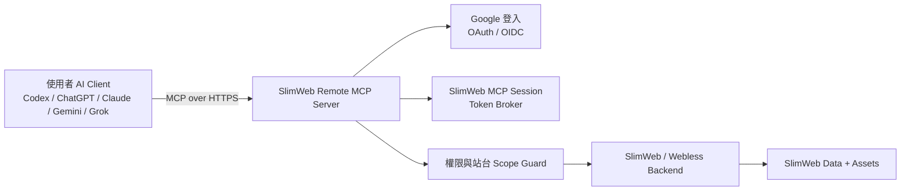

# SlimWeb-MCP

SlimWeb-MCP 是 SlimWeb / Webless 電商後台的 Remote MCP 閘道。主要目標是讓使用者透過自己的 AI Client，例如 Codex、ChatGPT、Claude、Gemini、Grok，直接操作 SlimWeb 後台，而不是被迫學習 SlimWeb 內部的頁面編輯邏輯、資料欄位或管理流程。

這個 repo 是 MCP 架構與實作的入口。SlimWeb / Webless 仍然是商品、訂單、頁面、素材、設定、會員與權限的 source of truth。

## 目標

- 提供 SlimWeb 後台可用的 Remote MCP Server。
- 透過 Google 登入驗證使用者身份。
- 讓每一次 MCP tool 呼叫都綁定使用者、帳號、站台與權限。
- 以明確的 MCP tools 開放常見電商後台操作。
- 讓 AI Client 只透過 tools 操作 SlimWeb，不直接碰資料庫、Storage 或內部後台路由。
- 將這份 README 當作持續維護的 tool contract。每新增或修改 MCP tool，都必須同步更新本文件。

## 非目標

- 不取代 SlimWeb / Webless 後端。
- 不另存一份商品、訂單、頁面或會員資料。
- 不繞過 SlimWeb 原本的角色與權限檢查。
- 不綁定單一 AI Client。
- 不提供 raw SQL、raw database、raw storage credential 類型的 MCP tool。
- 不把整個後台 UI 自動化暴露成不受控的瀏覽器操作。

## 架構總覽



Remote MCP Server 是 SlimWeb 前方的受控 adapter。AI Client 不直接連資料庫、Cloud Storage 或內部 admin route。Client 先完成 Google 登入，取得被限制範圍的 MCP session，再透過 tool discovery 得到可用工具，最後用 tools 操作 SlimWeb。

## 核心元件

### Remote MCP Server

Remote MCP Server 是 AI Client 對外連線的入口。

職責：

- 以 HTTPS 提供 MCP discovery 與 tool invocation。
- 對需要保護的 tools 強制要求登入。
- 驗證 tool input schema。
- 將 MCP request 轉成 SlimWeb 可執行的 application service 或 API 呼叫。
- 將 SlimWeb response 正規化成穩定的 MCP tool output。
- 回傳明確錯誤，例如未登入、權限不足、驗證失敗、需要確認、SlimWeb upstream error。

### Google 登入

Google 登入是 Remote MCP 的主要身份驗證方式。

職責：

- 透過 OAuth / OIDC 驗證 Google identity。
- 將 Google account 對應到 SlimWeb user。
- 建立或更新 SlimWeb MCP session。
- 將 session scope 限制在使用者可操作的 account、site、role、permissions。

預期登入流程：

1. AI Client 連到 SlimWeb Remote MCP Server。
2. 如果沒有有效 MCP session，server 回傳 authentication required 與 login URL。
3. 使用者在瀏覽器完成 Google 登入。
4. SlimWeb 驗證 Google identity，並綁定 SlimWeb user。
5. MCP Server 建立 scoped MCP session。
6. AI Client 重新進行 tool discovery 或 tool invocation。

### Session 與 Token Broker

Session layer 負責把 Google 驗證後的身份轉成 SlimWeb 可以接受的 MCP access。

規則：

- MCP session 必須是短效或可安全 refresh。
- token 不可包含 SlimWeb 內部 secret。
- MCP 驗證以 Web admin 為準，不以 webless 主會員 `accounts` 作為授權主體。
- Google 登入後必須能在 `site_admins` 找到至少一個擁有 `backend_ai_assistant` 權限的管理員身份，否則拒絕登入 MCP。
- session claims 至少要包含 Google `email`、`google_id`/`sub`、名稱與過期時間；站台與權限在每次 tool call 依 `site_id` 重新查 `site_admins`。
- 每次 tool 呼叫都要重新檢查權限，不可只依賴 discovery 時的結果。

### 權限與站台 Scope Guard

每個 tool 都必須在明確 scope 內執行。

最低 scope 欄位：

- `site_id`
- `site_admin_id`
- `google_email`
- `google_sub`
- `permissions`

以下情況必須拒絕 request：

- 使用者未登入。
- MCP session 已過期。
- 指定站台內找不到對應 Google 帳號的 Web admin 身份。
- 該 Web admin 沒有 `backend_ai_assistant` 權限。
- 該 Web admin 沒有 tool 所需 permission。
- tool 嘗試修改指定 `site_id` 以外的資料。
- 高風險操作需要 confirmation，但 request 沒有 confirmation token。

### SlimWeb Backend Adapter

Adapter 是 MCP Server 與 SlimWeb / Webless 後端之間的唯一連接層。

職責：

- 將 MCP tool request 對應到 SlimWeb application service 或 HTTP API。
- 優先重用 SlimWeb 現有 business rule，不在 MCP Server 重寫一份規則。
- 隔離 SlimWeb 內部 controller、model、route 的變化。
- 對外提供穩定 output，讓 AI Client 可以可靠推理。
- 記錄 tool execution audit log，方便追蹤與客服支援。

## 資料流

### Site Selection 與歧義處理

同一個 Google 帳號可能在多個 SlimWeb site 裡是 Web admin。AI Client 不可在無法判斷目標網站時自行猜測。

規則：

- 使用者登入後，AI 應先呼叫 `slimweb_sites_list` 取得可操作網站。
- 若只有一個 site，可自動選定該 site。
- 若有多個 site，且使用者沒有明確說出網站名稱、網域、site ID 或足以唯一識別的線索，AI 必須向使用者確認要操作哪個網站。
- 若使用者描述能比對到多個 site，AI 必須列出候選網站並要求使用者選擇。
- MCP 不保存 active site；所有 site-scoped tools 都必須明確帶入 `site_id`。
- 如果 AI 傳錯 `site_id`，server 會以 `NOT_FOUND` 或 `FORBIDDEN` 拒絕，不替 AI 猜測。
- AI Client 不需要知道 SlimWeb 的目錄結構，只需要透過 tools 查詢資料、選擇目標、提交結構化操作。

建議 AI 操作順序：

1. `slimweb_auth_status`
2. `slimweb_sites_list`
3. `slimweb_site_select`，或在無法唯一判斷時先問使用者
4. 依任務組合 read tools 與 write tools

### Tool Discovery

1. AI Client 連到 Remote MCP endpoint。
2. MCP Server 檢查 session。
3. MCP Server 查詢該 Google 身份可使用 MCP 的 Web admin sites，彙整 permissions 後回傳可用 tools。
4. AI Client 將 tools 提供給模型或使用者操作。

### Read Tool

1. Client 呼叫 read-only tool，例如列出商品、類別、訂單或優惠。
2. MCP Server 驗證 session 與 site scope。
3. Scope Guard 檢查 read permission。
4. Adapter 呼叫 SlimWeb。
5. MCP Server 回傳正規化結果。

### Write Tool

1. Client 呼叫 write tool，例如更新商品文案、替換商品圖片、調整訂單狀態或建立優惠。
2. MCP Server 驗證 input schema。
3. Scope Guard 檢查 write permission。
4. 高影響操作要求 confirmation。
5. Adapter 呼叫 SlimWeb。
6. MCP Server 回傳更新後摘要、warnings、audit ID。

## 初始 MCP Tools 規劃

第一階段先建立小而安全的 tool surface。每個 tool 都要具備權限檢查、input validation、錯誤處理、audit log 與文件更新，再進入可用狀態。

| Tool | 狀態 | 權限 | 用途 |
| --- | --- | --- | --- |
| `slimweb_auth_status` | Available | authenticated user | 回傳登入狀態、使用者摘要、目前 account。 |
| `slimweb_sites_list` | Available | account read | 列出使用者可操作的 SlimWeb sites。 |
| `slimweb_site_select` | Available | account read | 驗證並回傳 AI 後續 tool 呼叫要操作的 site。 |
| `slimweb_themes_list` | Available | content read | 列出站台的 Default 與自訂版型。 |
| `slimweb_site_theme_mode_get` | Available | content read | 讀取站台層級色系；Default 與所有自訂版型都沿用這個 light/dark 設定。 |
| `slimweb_design_context_get` | Available | content read | 回傳目前啟用版型的設計摘要、站台明暗色系與固定框架 `Tailwind`，供 AI 在視覺設計或畫圖前先讀取。 |
| `slimweb_site_theme_mode_update` | Available | content write | 將站台層級色系切換為 light 或 dark。 |
| `slimweb_themes_create_from_default` | Available | content write | 建立新版型，並只複製 Default shell/root-element template；首頁不屬於版型，非首頁內容頁預設沿用 Default。 |
| `slimweb_themes_activate` | Available | content write | 將指定版型設為前台啟用版型；會影響實際前台呈現。 |
| `slimweb_themes_delete` | Available | content write | 刪除非 Default 版型與其 template 內容；Default 不能刪除。 |
| `slimweb_theme_shell_get_context` | Available | content read | 回傳設計用 reference-only JSON，包含 nav、分類、購物車/登入按鈕、footer 聯絡資訊與線上客服狀態。 |
| `slimweb_themes_update_root_elements` | Available | content write | 更新非 Default 版型的 navbar、footer、online support 與 root CSS。 |
| `slimweb_theme_style_profile_get` | Available | content read | 讀取版型風格摘要與需求歷史。 |
| `slimweb_theme_style_profile_upsert` | Available | content write | 建立或更新版型風格摘要、色彩、字體、版面、插圖與避免事項。 |
| `slimweb_theme_style_profile_append_request` | Available | content write | 追加一筆使用者風格需求或變更紀錄。 |
| `slimweb_site_readiness_get` | Available | site readiness read | 回傳站台目前缺少或不完整的設定區塊，讓 AI 可主動回答開站缺口。 |
| `slimweb_seo_settings_get` | Available | content read | 讀取後台 SEO 設定頁也會顯示的 SEO / AEO / GEO 欄位。 |
| `slimweb_seo_settings_update` | Available | content write | 更新站台層級 SEO、AEO、GEO、OG 與 llms.txt 設定。 |
| `slimweb_integration_settings_get` | Available | settings read | 讀取後台串接設定頁顯示的 Facebook、Google 會員登入、LINE 會員登入、AI API、Notion 等欄位。 |
| `slimweb_integration_settings_update` | Available | settings write | 更新串接設定欄位；Google/LINE 用於會員登入，Facebook 另支援 Messenger/Page ID 與留言板。 |
| `slimweb_mail_templates_get` | Available | mail settings read | 讀取各寄送時機的郵件標題與內容；內容會套用單一共用郵件版型。 |
| `slimweb_mail_templates_update` | Available | mail settings write | 更新各寄送時機的郵件標題、HTML 內容與啟用狀態。 |
| `slimweb_mail_layout_get` | Available | mail settings read | 讀取站台唯一共用郵件版型與預設版型 HTML。 |
| `slimweb_mail_layout_update` | Available | mail settings write | 更新站台唯一共用郵件版型；版型應保留 `{content}` 佔位符。 |
| `slimweb_payment_logistics_get` | Available | payment/logistics read | 讀取 SlimWeb 目前支援的金物流供應商與站台設定。 |
| `slimweb_payment_logistics_update` | Available | payment/logistics write | 更新支援的金物流資料與啟用狀態；線上刷卡金流只能啟用一家，LINE Pay 例外。 |
| `slimweb_dashboard_summary` | Available | dashboard read | 讀取 KPI、最新訂單、最新會員、低庫存提醒等後台首頁摘要。 |
| `slimweb_settings_get` | Available | settings read | 讀取網站狀態、國別、商品載入方式、允許退貨天數等基本設定。 |
| `slimweb_settings_update` | Available | settings write | 更新允許由 MCP 修改的基本設定欄位。 |
| `slimweb_admins_list` | Available | admin read | 列出站台管理員與權限摘要；第一個 admin 為受保護系統管理員。 |
| `slimweb_admins_upsert` | Available | admin write | 新增或更新站台管理員與權限；第一個 admin 永遠保留系統管理員。 |
| `slimweb_admins_delete` | Available | admin write | 刪除站台管理員；第一個系統管理員不能刪除。 |
| `slimweb_categories_list` | Available | product read | 列出商品分類樹、leaf 狀態與商品數。 |
| `slimweb_categories_upsert` | Available | product write | 新增或更新商品分類名稱、父層、排序與 AI 生成 SVG icon。 |
| `slimweb_categories_delete` | Available | product write | 刪除沒有任何商品的商品分類與其空子分類。 |
| `slimweb_nav_items_list` | Available | page read | 列出導覽項目樹、類型、URL 與 icon 狀態。 |
| `slimweb_nav_items_upsert` | Available | page write | 新增或更新導覽項目名稱、父層、類型、URL、排序與 AI 生成 SVG icon。 |
| `slimweb_nav_items_delete` | Available | page write | 刪除導覽項目與其子項目。 |
| `slimweb_products_list` | Available | product read | 依狀態、分類、關鍵字與庫存條件列出商品。 |
| `slimweb_products_get` | Available | product read | 讀取單一商品，包含圖片、影片、規格與數量折扣。 |
| `slimweb_products_upsert` | Available | product write | 新增或更新商品；主圖至少一張，缺必要資訊時 AI 必須先詢問。 |
| `slimweb_products_delete` | Available | product write | 刪除商品與已儲存商品圖片。 |
| `slimweb_products_import_inspect` | Available | product read | 解析 CSV/XLSX/SQL，回傳欄位、樣本列與分類，讓 AI Client 自行分析 mapping。 |
| `slimweb_products_import_validate` | Available | product read | 驗證 AI Client 產生的 mapping 是否可匯入，失敗時回傳原因。 |
| `slimweb_products_import_commit` | Available | product write | 使用已確認 mapping 將商品寫入 SlimWeb，不在後端呼叫 OpenAI。 |
| `slimweb_uploads_create` | Available | asset write | 向 Webless 申請短效 signed upload URL，讓 AI client Python sandbox 直接 PUT 圖片 bytes。 |
| `slimweb_uploads_commit` | Available | asset write | 提交已上傳圖片，讓 Webless 走後台同一套圖片驗證與 resize，回傳 `media_path`。 |
| `slimweb_pages_delete` | Available | content write | 刪除自訂頁面內容；固定系統頁不可刪除。 |
| `slimweb_orders_list` | Available | order read | 用後台同一套搜尋參數查正常訂單；「待處理」請用 `logistics_status=pending`，代表金流完成但物流未完成。超過 20 筆時 AI 應請用戶到後台縮小條件。 |
| `slimweb_orders_profit_statistics` | Available | order read | 計算已付款且未取消訂單的純利；不帶日期代表全部，問「這個月」時由 AI 帶入當月起訖日期。 |
| `slimweb_orders_get` | Available | order read | 讀取單一訂單，包含品項、付款、物流、退貨、退款與 `available_actions`。 |
| `slimweb_orders_create_logistics` | Available | order write | 依 `available_actions` 建立正物流單。 |
| `slimweb_orders_mark_shipped` | Available | order write | 無物流單時手動標記出貨完成。 |
| `slimweb_returns_pending_list` | Available | order read | 列出待處理退貨單，包含可取消、手動完成或建立逆物流的操作。 |
| `slimweb_returns_create_logistics` | Available | order write | 依 `available_actions` 建立逆物流單。 |
| `slimweb_returns_cancel` | Available | order write | 取消退貨並回到正常完成訂單。 |
| `slimweb_returns_complete` | Available | order write | 無逆物流時手動標記已完成退貨。 |
| `slimweb_refunds_complete` | Available | order write | 手動標記已完成退款。 |
| `slimweb_refunds_create` | Available | order write | 依 `available_actions` 建立綠界或藍新刷退。 |
| `slimweb_members_list` | Available | member read | 列出會員與篩選會員資料。 |
| `slimweb_members_get` | Available | member read | 讀取單一會員摘要、訂單摘要、優惠券與等級。 |
| `slimweb_members_coupons_issue` | Available | member write + promotion write | 手動發券給指定會員，只接受 active manual coupon template。 |
| `slimweb_newsletters_create` | Available | member write | 建立電子報資料，支援全部會員或指定會員；不直接寄送，未指定發送時間時預設為當下時間 + 5 分鐘。 |
| `slimweb_coupon_templates_list` | Available | promotion read | 列出優惠券模板，含 manual、all_members、order_threshold、birthday、product_bundle。 |
| `slimweb_coupon_templates_upsert` | Available | promotion write | 新增或更新優惠券模板，套用與後台優惠券表單一致的發放規則。 |
| `slimweb_discount_codes_list` | Available | promotion read | 列出折扣碼。 |
| `slimweb_discount_codes_upsert` | Available | promotion write | 新增或更新折扣碼。 |
| `slimweb_member_tiers_list` | Available | promotion read | 列出會員等級與門檻。 |
| `slimweb_member_tiers_upsert` | Available | promotion write | 新增或更新會員等級。 |
| `slimweb_threshold_gifts_list` | Available | promotion read | 列出滿額禮。 |
| `slimweb_threshold_gifts_upsert` | Available | promotion write | 新增或更新滿額禮。 |
| `slimweb_product_add_ons_list` | Available | promotion read | 列出單品加購規則。 |
| `slimweb_product_add_ons_upsert` | Available | promotion write | 新增或更新單品加購規則。 |
| `slimweb_articles_list` | Available | content read | 列出文章，讓 AI 避免重複建立或挑選要更新的文章。 |
| `slimweb_articles_upsert` | Available | content write + asset write | 新增或更新文章內容、HTML 排版、主圖與內容圖。 |
| `slimweb_customer_service_logs_list` | Available | customer service read | 查詢 AI 客服紀錄。 |
| `slimweb_customer_service_settings_get` | Available | customer service read | 讀取 AI 客服設定摘要。 |
| `slimweb_customer_service_settings_update` | Available | customer service write | 更新 AI 客服設定。 |
| `slimweb_exports_create` | Available | export read | 建立會員、訂單或退貨匯出檔。 |
| `slimweb_images_import_chatgpt_attachment` | Available | asset write | 匯入 ChatGPT web/desktop 對話附件圖片，回傳可用於商品、文章或頁面的 `media_path`。 |
| `slimweb_debug_attachment_refs` | Available | diagnostic read | 診斷 ChatGPT Remote MCP 實際傳入的附件參數形狀；只回傳去敏摘要，不下載、不上傳、不寫入素材庫。 |
| `slimweb_assets_upload` | Available | asset write | 只有當 AI flow 明確需要保存可重用素材時才寫入 asset。 |
| `slimweb_pages_list` | Available | content read | 列出與搜尋固定頁/自訂頁；自訂頁回傳實際公開網址供導覽列與後續修改使用。 |
| `slimweb_pages_get_home_content` | Available | content read | 讀取首頁目前儲存在 Webless template storage 的 body/content。 |
| `slimweb_pages_update_home_content` | Available | content write | 替換首頁 body/content；禁止直接寫入 script/link/iframe 與 inline event handler。 |
| `slimweb_pages_upsert` | Available | content write | 新增或更新自訂頁面內容；固定系統頁不可覆寫。 |
| `slimweb_preview_get_page_url` | Available | content read | 回傳指定 site、page、theme 的預覽 URL，供 AI 自行截圖與檢查。 |
| `slimweb_external_assets_list` | Available | asset read | 列出站台、版型或頁面層級引用的外部 CSS / JS。 |
| `slimweb_external_assets_upsert` | Available | asset write + content write | 新增或更新外部 CSS / JS 引用；AI 必須提供 URL 與用途。 |
| `slimweb_external_assets_delete` | Available | asset write + content write | 刪除外部 CSS / JS 引用。 |
| `slimweb_external_assets_reorder` | Available | asset write + content write | 調整外部 CSS / JS 載入順序。 |
| `slimweb_audit_list` | Available | audit read | 列出近期 MCP tool execution 紀錄。 |

## Tool 文件維護規範

每新增或修改一個 tool，都必須在同一個 PR 更新本 README。格式如下：

```md
### `tool.name`

- 狀態:
- 權限:
- Scope:
- 用途:
- Input:
- Output:
- Side effects:
- 是否需要 confirmation:
- 錯誤情境:
- Audit fields:
```

規則：

- 實作 tool 的 PR 必須同步更新文件。
- experimental tool 要清楚標示。
- tool 尚未進入 MCP discovery 前，不可標成可用。
- 任何會修改客戶可見內容的 input，都要寫明 validation 與 rollback / recovery 行為。
- 任何會處理圖片的 tool，都要寫明圖片是 reference-only，還是會保存成 reusable asset。

## Tool Contracts

### 共通 Tool Rules

- 所有 tools 預設都需要有效 Google 登入與 MCP session。
- 除 `slimweb_auth_status`、`slimweb_sites_list`、`slimweb_site_select` 之外，tools 都需要明確 `site_id`。
- MCP 只接受有 `backend_ai_assistant` 權限的 Web admin 身份。各 tool 仍會再檢查該模組權限。
- 若 active site 無法從使用者語意唯一判斷，AI 必須先問使用者，不可猜測。
- Read tools 應回傳 stable IDs，讓 AI 後續 write tools 能精準指定目標。
- Write tools 不接受模糊目標，例如「第一個商品」；AI 必須先用 read tool 取得候選，再讓使用者或語意唯一指定。
- 需要圖片的 tools 不接受 inline base64、image URL、file URL、`/mnt/data`、attachment handle、data ref、placeholder URL 或任何本地路徑。
- 圖片流程固定為：AI 必須先判斷自己所在 runtime 是否能讀取圖片 bytes 並對外做 HTTPS `PUT`。Codex / Hermes 這類有本地或 code execution access 的 client 可以先呼叫 `slimweb_uploads_create`，讀取使用者上傳圖片或 AI 生成圖片的 binary，對 returned `upload_url` 做 raw bytes `PUT`，再呼叫 `slimweb_uploads_commit`，最後把回傳 `asset.media_path` 傳給商品、文章或 asset tools。
- ChatGPT Remote MCP 目前不可假設能把對話附件、`/mnt/data` 或 hidden attachment rewrite 轉成 remote MCP 可讀 bytes。若 AI 所在 client 不能讀取圖片 bytes 或不能對 `upload_url` 做 `PUT`，必須直接向使用者說明此 client 無法透過 MCP 上傳圖片，請改用 Codex / Hermes 或提供可直接下載的圖片 URL。
- Webless 端負責與後台手動上傳一致的驗證、decode/re-encode、等比例縮圖與公開媒體 URL 產生；MCP 不再承接大段圖片 payload。
- 外部 CSS / JS 不可直接寫入頁面內容、文章內容或版型內容；AI 必須使用 `slimweb_external_assets_*` tools 以結構化 URL 管理。
- Write tools 應拒絕未經 allowlist 的 `<script>`、`<link rel="stylesheet">`、inline event handler 與可執行片段，除非該 tool 明確標示支援且通過安全驗證。
- AI 不需要知道 SlimWeb 檔案目錄或後端 route，只需依 tool contract 使用 tools。

### `slimweb_auth_status`

- 狀態: Available
- 權限: authenticated Web admin with `backend_ai_assistant`
- Scope: Google identity session
- 用途: 回傳目前登入與 scope 狀態。
- Input: none
- Output: login status、admin identity summary、session expiry
- Side effects: none
- 是否需要 confirmation: no
- 錯誤情境: expired session、invalid token
- Audit fields: request ID、user ID、session ID

### `slimweb_sites_list`

- 狀態: Available
- 權限: authenticated Web admin with `backend_ai_assistant`
- Scope: Google identity across `site_admins`
- 用途: 列出此 Google 帳號可透過 MCP 操作的 Web admin sites。
- Input: optional pagination、keyword filter
- Output: site IDs、site admin IDs、names、domains、permissions、`site_status` (`active` or `maintenance`)、`site_status_label`、多站台時的 selection instruction
- Side effects: none
- 是否需要 confirmation: no
- 錯誤情境: unauthorized、no linked SlimWeb account
- Audit fields: request ID、user ID、account ID

### `slimweb_site_select`

- 狀態: Available
- 權限: authenticated Web admin with `backend_ai_assistant`
- Scope: selected `site_id`
- 用途: 驗證使用者可操作指定 site，並回傳 site summary 與可用 theme/page scheme。AI Client 不可在多站台歧義時自行猜測。
- Input: `site_id`
- Output: selected site summary、themes、mutation scope hints
- Side effects: none；目前不把 active site 寫入 session，write tools 仍必須明確帶 `site_id`
- 是否需要 confirmation: no
- 錯誤情境: site not found、site not accessible
- Audit fields: request ID、user ID、account ID、site ID

### `slimweb_themes_list`

- 狀態: Available
- 權限: content read
- Scope: active site
- 用途: 列出目前站台可用版型，讓 AI 知道 Default、active theme 與可設計的自訂版型。
- Input: `site_id`
- Output: site summary、site-level theme mode、theme IDs、names、is default、is active、inherits site theme mode
- Side effects: none
- 是否需要 confirmation: no
- 錯誤情境: site not found、site not accessible
- Audit fields: request ID、user ID、account ID、site ID

### `slimweb_site_theme_mode_get`

- 狀態: Available
- 權限: content read
- Scope: active site
- 用途: 讀取站台層級色系。此設定是 Default 與所有自訂版型的唯一 light/dark 來源。
- Input: `site_id`
- Output: site summary、`theme_mode` (`light` 或 `dark`)、scope
- Side effects: none
- 是否需要 confirmation: no

### `slimweb_design_context_get`

- 狀態: Available
- 權限: content read
- Scope: active site
- 用途: 在 AI 開始任何頁面視覺設計、版型設計、插圖或畫圖前，先回傳目前啟用版型的設計摘要、站台明暗色系與固定框架資訊，避免風格走偏。
- Input: `site_id`
- Output: site summary、active theme summary、`design_summary`、`color_mode` (`light` 或 `dark`)、`color_mode_label`（明亮或黑暗）、`framework` (`Tailwind`)
- Side effects: none
- 是否需要 confirmation: no
- 重要規則: 若是視覺設計相關任務，AI 應先讀這個 tool，再視需要補讀 `slimweb_theme_shell_get_context`。

### `slimweb_site_theme_mode_update`

- 狀態: Available
- 權限: content write
- Scope: active site
- 用途: 更新站台層級色系。使用者要求 neon、螢光字、暗色高對比或明亮極簡時，AI 應先確認色調屬於 `light` 或 `dark`，必要時呼叫此 tool。
- Input: `site_id`、`theme_mode` (`light` 或 `dark`)
- Output: updated site summary、`theme_mode`、scope
- Side effects: updates `sites.theme_mode`; custom style schemes inherit this value.
- 是否需要 confirmation: yes when changing an existing site color mode

### `slimweb_themes_create_from_default`

- 狀態: Available
- 權限: content write
- Scope: active site
- 用途: 建立新版型。此 tool 會新增一筆非 Default `site_pages` 記錄，並只將 Default 的 shell/root-element template storage 複製到新版型目錄。
- Input: `site_id`、`name`
- Output: site summary、created theme summary、copied flag、`copied_scope`、`content_fallback`、`inherits_site_theme_mode`、preview URL
- Side effects: creates site page style scheme and copies Default shell files. It does not copy `pages/*` body/content files.
- 色系規則: 此 tool 不選擇 light/dark；新版型沿用 `sites.theme_mode`。若設計需求跟色調有關，先用 `slimweb_site_theme_mode_get/update`。
- 是否需要 confirmation: yes when user did not explicitly ask to create a new theme
- 錯誤情境: site not found、invalid name、storage adapter not configured、upstream write failed
- Audit fields: request ID、user ID、account ID、site ID、theme ID

### `slimweb_themes_activate`

- 狀態: Available
- 權限: content write
- Scope: active site and selected theme
- 用途: 將指定版型設為前台啟用版型。AI 必須在使用者明確確認要切換前台版型後才呼叫。
- Input: `site_id`、`theme_id`
- Output: site summary、activated theme summary、updated themes list、preview URL
- Side effects: sets all other site themes inactive and selected theme active
- 是否需要 confirmation: yes
- 錯誤情境: site not found、theme not found、database write failed
- Audit fields: request ID、user ID、account ID、site ID、theme ID

### `slimweb_theme_shell_get_context`

- 狀態: Available
- 權限: content read
- Scope: active site and selected theme
- 用途: 在建立或修改版型前，讓 AI 取得實際會接上的資料摘要 JSON，例如 nav item 數量/名稱/樹狀結構、商品分類數量/名稱、購物車/登入/註冊按鈕、footer 聯絡資訊數量與線上客服狀態。
- Input: `site_id`、`theme_id`
- Output: `reference_only: true`、site summary、theme summary、`theme_scope`、`navbar`、`product_categories`、`storefront_actions`、`footer`、`online_support`
- Side effects: none
- 重要規則: 此 JSON 僅供設計參考，不可直接把 nav/footer/contact 寫死進 root element 或 page body。AI 應依此資料量預留版面、選擇 icon/spacing，實際資料仍由 Webless runtime 接上。
- 是否需要 confirmation: no
- 錯誤情境: site not found、theme not found、database read failed
- Audit fields: request ID、user ID、account ID、site ID、theme ID

### `slimweb_themes_update_root_elements`

- 狀態: Available
- 權限: content write
- Scope: active site and non-Default theme
- 用途: 更新新版型的 root elements，例如 navbar、footer、online support，以及 root-level CSS。Default 版型不可用此 tool 修改 root elements。
- Input: `site_id`、`theme_id`、optional `fragments.navbar`、`fragments.footer`、`fragments.online_support`、optional `css`
- Output: write summary、theme summary、updated fragments、CSS updated flag、preview URL
- Side effects: writes root element Blade fragments and `assets/root-elements/css/00-mcp-theme.css`
- 是否需要 confirmation: yes for customer-facing active theme
- 錯誤情境: theme not found、attempting to modify Default、unsafe HTML、storage adapter not configured
- Audit fields: request ID、user ID、account ID、site ID、theme ID、updated fragments

### `slimweb_theme_style_profile_get`

- 狀態: Available
- 權限: content read
- Scope: active site and selected theme
- 用途: 讀取版型風格摘要，讓 AI 在視覺設計前知道既有方向、限制與使用者曾提出的變更。
- Input: `site_id`、`theme_id`
- Output: site summary、theme summary、nullable `profile`
- Side effects: none
- 是否需要 confirmation: no
- 錯誤情境: site not found、theme not found、profile table not migrated
- Audit fields: request ID、user ID、account ID、site ID、theme ID

### `slimweb_theme_style_profile_upsert`

- 狀態: Available
- 權限: content write
- Scope: active site and selected theme
- 用途: 建立或更新版型風格摘要，包含 `summary`、`target_audience`、`visual_keywords`、`color_notes`、`typography_notes`、`layout_notes`、`illustration_notes`、`avoid_notes`、`user_request(s)`、`ai_design_notes`。
- Input: `site_id`、`theme_id` and at least one style/profile field
- Output: write summary、theme summary、profile
- Side effects: upserts `site_theme_style_profiles`
- 是否需要 confirmation: no, unless changing an active customer-facing theme's declared direction against the user's current request
- 錯誤情境: site not found、theme not found、profile table not migrated、invalid JSON field
- Audit fields: request ID、user ID、account ID、site ID、theme ID

### `slimweb_theme_style_profile_append_request`

- 狀態: Available
- 權限: content write
- Scope: active site and selected theme
- 用途: 追加一筆使用者需求或變更紀錄，不覆蓋既有風格摘要。適合記錄「文青一點」、「字體不要那麼粗」、「背景補手繪插圖」等要求。
- Input: `site_id`、`theme_id`、`request`、optional `ai_notes`
- Output: write summary、theme summary、updated profile
- Side effects: appends to `site_theme_style_profiles.user_requests` and increments profile version
- 是否需要 confirmation: no
- 錯誤情境: site not found、theme not found、profile table not migrated
- Audit fields: request ID、user ID、account ID、site ID、theme ID

### `slimweb_site_readiness_get`

- 狀態: Available
- 權限: site readiness read
- Scope: active site
- 用途: 讀取站台開站/營運準備度，回傳目前缺少或不完整的地方，讓 AI 可以主動告知使用者「還缺什麼」。
- Input: `site_id`, optional `include_optional`
- Output: site summary、summary (`status`, `readiness_score`, issue counts)、categories、missing_categories、next_actions、evidence counts
- 檢查範圍:
  - 金物流: 是否啟用、憑證是否完整、是否仍全為 test mode
  - 商品資料: 商品類別、商品數、上架商品、未分類商品
  - 第三方登入: Google Client ID、LINE Channel ID / Secret
  - 對外資訊: SEO、AEO、GEO、llms.txt
  - 導覽與內容: navbar、文章
  - 客服與權限: AI 客服、後台管理員、backend_ai_assistant 權限
  - Optional: 優惠券模板、折扣碼
- Side effects: none
- 是否需要 confirmation: no
- 錯誤情境: site not found、permission denied
- Audit fields: request ID、user ID、account ID、site ID

### `slimweb_seo_settings_get`

- 狀態: Available
- 權限: content read
- Scope: active site
- 用途: 讀取站台層級 SEO / AEO / GEO 設定，這些欄位會顯示在 SlimWeb 後台的 SEO 設定頁。
- Input: `site_id`
- Output: site summary、settings (`seo_title`, `seo_description`, `seo_keywords`, `canonical_url`, `robots_policy`, `og_title`, `og_description`, `og_image_url`, `llms_txt`, `aeo_business_summary`, `aeo_target_audience`, `aeo_products_services`, `aeo_customer_questions`, `aeo_answer_style`, `aeo_entity_facts`, `geo_citation_targets`, `geo_verifiable_claims`, `geo_trust_signals`, `geo_same_as_profiles`, `geo_comparison_positioning`)
- Side effects: none
- 是否需要 confirmation: no
- 錯誤情境: site not found、permission denied
- Audit fields: request ID、user ID、account ID、site ID

### `slimweb_seo_settings_update`

- 狀態: Available
- 權限: content write
- Scope: active site
- 用途: 更新站台層級 SEO、OG、llms.txt、AEO 與 GEO 欄位。適合「我是賣服飾的，幫我做好 SEO / AEO / GEO」這類需求，由 AI 產生結構化設定後寫入同一份後台資料。
- Input: `site_id` plus any subset of SEO/AEO/GEO fields
- Output: updated settings、site summary
- Side effects: updates `sites` SEO/AEO/GEO columns that SlimWeb admin displays
- 是否需要 confirmation: yes when changing robots policy to noindex or replacing existing customer-facing metadata
- 錯誤情境: validation failed、site not found、permission denied、conflict
- Audit fields: request ID、user ID、account ID、site ID、changed fields

### `slimweb_integration_settings_get`

- 狀態: Available
- 權限: settings read
- Scope: active site
- 用途: 讀取後台串接設定頁的資料。Google 與 LINE 欄位目前只對應會員登入串接；Facebook 除會員登入外，也包含 Messenger/Page ID 與 FB 留言板設定；另含 AI API、Notion 與簡訊設定。
- Input: `site_id`
- Output: site summary、settings (`facebook_app_id`, `facebook_page_id`, `facebook_comment_on_products`, `facebook_comment_on_posts`, `line_login_channel_id`, `line_login_channel_secret`, `google_login_client_id`, `ai_provider`, `ai_api_key`, `ai_model_name`, `notion_token`, etc.)
- Side effects: none
- 是否需要 confirmation: no
- 錯誤情境: site not found、permission denied
- Audit fields: request ID、user ID、account ID、site ID

### `slimweb_integration_settings_update`

- 狀態: Available
- 權限: settings write
- Scope: active site
- 用途: 更新後台串接設定。使用者把會員登入、Facebook Messenger/Page ID、FB 留言板、AI API 或 Notion 的 key/token/id 交給 AI 後，AI 可用此 tool 保存回 Webless 的同一份 settings。
- Input: `site_id` plus any subset of integration fields
- Output: updated settings、site summary
- Side effects: updates `sites` integration columns that SlimWeb admin displays
- 是否需要 confirmation: yes when changing API keys, bot tokens, Notion token, login client IDs, or disabling/enabling customer-facing integrations
- 錯誤情境: validation failed、site not found、permission denied、conflict
- Audit fields: request ID、user ID、account ID、site ID、changed fields

### `slimweb_mail_templates_get`

- 狀態: Available
- 權限: mail settings read
- Scope: active site
- 用途: 讀取各事件郵件內容。這些是「內容模板」，不是共用外框；寄送時 SlimWeb 會把內容放進唯一共用郵件版型的 `{content}`。
- 支援事件: `order_created`、`order_shipped`、`store_arrived`、`return_requested`、`return_logistics`、`registration_code`、`password_reset`
- Input: `site_id`
- Output: templates、layout rule
- Side effects: none
- 是否需要 confirmation: no
- 錯誤情境: site not found、permission denied
- Audit fields: request ID、user ID、account ID、site ID

### `slimweb_mail_templates_update`

- 狀態: Available
- 權限: mail settings write
- Scope: active site
- 用途: 更新各事件郵件的 subject、HTML content 與啟用狀態。AI 可依使用者商品、品牌語氣、訂單流程設計郵件內容，但不應在這裡修改整體版型。
- Input: `site_id`、`templates[]`，每筆包含 `trigger_event` 與 optional `subject`、`content`、`is_active`
- Output: updated templates
- Side effects: upserts `mail_templates`
- Rule: `member_name` 會在寄送時替換為會員/買家名稱；訂單相關事件會由 Webless 自動附上訂單明細。
- 是否需要 confirmation: yes when changing customer-facing copy or disabling a mail event
- 錯誤情境: validation failed、unsupported trigger_event、site not found、permission denied
- Audit fields: request ID、user ID、account ID、site ID、trigger events

### `slimweb_mail_layout_get`

- 狀態: Available
- 權限: mail settings read
- Scope: active site
- 用途: 讀取站台唯一共用郵件版型。所有事件郵件都共用這一個外框。
- Input: `site_id`
- Output: current layout、default layout HTML、available placeholders (`{content}`, `{site_name}`, `{site_url}`, `{logo_url}`)
- Side effects: none
- 是否需要 confirmation: no
- 錯誤情境: site not found、permission denied
- Audit fields: request ID、user ID、account ID、site ID

### `slimweb_mail_layout_update`

- 狀態: Available
- 權限: mail settings write
- Scope: active site
- 用途: 更新站台唯一共用郵件版型。預設版型為網站 logo + 網站名稱、分隔線、內容、分隔線、footer 網站網址。
- Input: `site_id`、`html`、`is_active`
- Output: updated layout、default layout HTML
- Side effects: upserts `site_mail_layouts`
- Rule: 建議保留 `{content}`；若缺少 `{content}`，Webless 會在版型後方附加郵件內容。
- 是否需要 confirmation: yes
- 錯誤情境: validation failed、site not found、permission denied
- Audit fields: request ID、user ID、account ID、site ID

### `slimweb_payment_logistics_get`

- 狀態: Available
- 權限: payment/logistics read
- Scope: active site
- 用途: 讀取 SlimWeb 支援的金流與物流供應商，以及目前站台的啟用狀態與設定摘要。AI 回答「我的 SlimWeb 網站能用什麼金流？」時必須以此 tool 回傳的 `supported_payment_providers` 為準，不可自行補充未支援供應商。
- 支援金流: `ecpay` (綠界 ECPay)、`newebpay` (藍新 NewebPay)、`linepay` (LINE Pay)
- LINE Pay 支援測試環境與付款等待頁語系設定；後台欄位以 Channel ID / Channel Secret 對應 `merchant_id` / `hash_key`，不使用 `hash_iv`。
- 支援物流: `ecpay` (綠界物流)、`newebpay` (藍新物流)、`hct` (新竹物流)
- Input: `site_id`
- Output: supported payment/logistics providers、online card exclusivity rule、answer policy、current provider states、provider Notify URL / Return URL、store-map callback URL
- Side effects: none
- 是否需要 confirmation: no
- 錯誤情境: site not found、permission denied
- Audit fields: request ID、user ID、account ID、site ID

### `slimweb_payment_logistics_update`

- 狀態: Available
- 權限: payment/logistics write
- Scope: active site
- 用途: 更新支援的金流與物流供應商設定。金流包含 mode、啟用狀態、merchant ID、HashKey、HashIV、語系；物流包含啟用狀態、寄件資訊、超商通路、綠界 C2C/B2C 型態與新竹物流代收設定。綠界/藍新物流沿用同家金流的環境與商店代號，不另外儲存 HashKey/HashIV。
- Input: `site_id`、optional `payments[]`、optional `logistics[]`
- Output: updated provider states、supported provider list、answer policy
- Side effects: upserts `site_payment_providers` / `site_logistics_providers`; writes encrypted provider settings compatible with Webless Laravel `encrypted:array`
- Rule: `ecpay` 與 `newebpay` 屬於線上刷卡金流，同一站台只能啟用其中一家；啟用其中一家會停用另一家。`linepay` 可同時啟用，不受此限制。
- Logistics rule: 綠界物流與藍新物流沒有獨立啟用開關，啟用同家的金流時即視為一併啟用同家物流；停用同家金流時物流也會停用。綠界物流超商通路為 `seven`、`family`、`hilife`、`ok`，並可設定 `logistics_type` = `c2c` 或 `b2c`；C2C/B2C 必須與綠界後台申請項目一致，若需要建立逆物流請使用 B2C。藍新物流超商通路目前使用 `seven`、`family`、`hilife`，不把 OK 當成預設可用通路；可用通路與寄件模式以藍新後台啟用項目為準。新竹物流使用 `merchant_id` 作為 API 公司名稱、`password` 作為 API 密碼、optional `customer_id` 作為客代；新竹物流沒有後台測試/正式模式下拉，測試時使用文件提供的測試公司名稱 `test` 與密碼 `test1`。新竹物流保留自己的 `is_enabled`，`collect_payment_enabled` 為 true 時前台可顯示貨到付款。
- AI answer rule: 使用者問自己的 SlimWeb 站台支援哪些金物流時，先呼叫 `slimweb_payment_logistics_get`，並只依支援清單回答。使用者問一般「電商網站用什麼金流」時，不把未支援供應商描述成 SlimWeb 可用。
- 是否需要 confirmation: yes when enabling/disabling providers or changing credentials
- 錯誤情境: validation failed、unsupported provider、missing credentials、multiple online card providers enabled、encryption key not configured、site not found、permission denied
- Audit fields: request ID、user ID、account ID、site ID、provider IDs、changed fields

### `slimweb_dashboard_summary`

- 狀態: Available
- 權限: dashboard read
- Scope: active site
- 用途: 回傳後台首頁摘要，讓 AI 快速理解目前站台狀況。
- Input: optional date range
- Output: KPI summary、latest orders、latest members、low stock products、traffic summary if available
- Side effects: none
- 是否需要 confirmation: no
- 錯誤情境: missing active site、permission denied
- Audit fields: request ID、user ID、account ID、site ID

### `slimweb_settings_get`

- 狀態: Available
- 權限: settings read
- Scope: active site
- 用途: 讀取 AI 後台操作需要的站台基本設定。
- Input: optional fields list
- Output: site status、country、product loading mode、return days allowed、editable field hints
- Side effects: none
- 是否需要 confirmation: no
- 錯誤情境: missing active site、permission denied
- Audit fields: request ID、user ID、account ID、site ID

### `slimweb_settings_update`

- 狀態: Available
- 權限: settings write
- Scope: active site
- 用途: 更新允許 MCP 修改的基本設定。
- Input: patch object，僅允許 allowlist 欄位，例如 site status、country、product loading mode、return days allowed
- Output: updated settings summary、changed fields、warnings、audit ID
- Side effects: modifies site settings
- 是否需要 confirmation: yes for disabling site、changing return policy、or settings that affect storefront behavior
- 錯誤情境: validation failed、permission denied、unsupported field、conflict
- Audit fields: request ID、user ID、account ID、site ID、changed fields

### `slimweb_admins_list`

- 狀態: Available
- 權限: admin read
- Scope: active site
- 用途: 列出站台管理員與權限摘要，讓 AI 在權限問題上能先查清楚現況。
- Input: optional keyword、role、pagination
- Output: admin summaries、roles、permission summary、status、last updated time
- Side effects: none
- 是否需要 confirmation: no
- 錯誤情境: missing active site、permission denied
- Audit fields: request ID、user ID、account ID、site ID

### `slimweb_admins_upsert`

- 狀態: Available
- 權限: admin write
- Scope: active site
- 用途: 新增或更新站台管理員與權限。
- Input: optional admin ID、`google_email`、permissions
- Output: admin summary、changed permissions、audit ID
- Side effects: creates or modifies admin access
- 是否需要 confirmation: yes
- 錯誤情境: validation failed、admin not found、duplicate admin、cannot modify owner、permission denied、conflict
- Audit fields: request ID、user ID、account ID、site ID、target admin ID、changed permissions

### `slimweb_categories_list`

- 狀態: Available
- 權限: product read
- Scope: active site
- 用途: 列出商品分類，支援「目前商品有哪些類別？」這類問題。
- Input: site ID
- Output: category tree、flat categories、leaf flag、product counts
- Side effects: none
- 是否需要 confirmation: no
- 錯誤情境: missing active site、permission denied
- Audit fields: request ID、user ID、account ID、site ID

### `slimweb_categories_upsert`

- 狀態: Available
- 權限: product write
- Scope: active site
- 用途: 新增或更新商品分類。
- Input: optional category ID、optional current name、new name、optional parent category ID、optional icon SVG base64、optional 16:9 image、optional sort order
- Output: action (`created` / `updated`)、matched_by、changed fields、category summary
- Side effects: creates or modifies category
- Rename rule: 使用者說「把 A 改名為 B」時，AI 必須先用 `slimweb_categories_list` 找到 category ID；若沒有 ID，傳 `current_name: "A"` 與 `name: "B"`，不可只傳新名稱後宣稱已更新舊分類。
- Parent rule: 建立時使用者沒有明確指定父項目，AI 應省略 `parent_id` 或傳 `null`，表示 root category；例如「建立男裝類別」不應自行推斷到「服飾」底下。更新時省略 `parent_id` 會保留原父層，明確傳 `null` 才移到 root。
- Icon rule: 建立分類時 AI 必須依照使用者文字生成 SVG icon，base64 encode 後放入 `icon_svg_base64`；使用者未指定顏色時使用 `#9ca3af`。更新時若要重畫 icon，再傳新的 `icon_svg_base64`。
- 錯誤情境: validation failed、duplicate name、parent not found、cycle detected、missing icon on create、permission denied
- Audit fields: request ID、user ID、account ID、site ID、category ID、changed fields

### `slimweb_nav_items_list`

- 狀態: Available
- 權限: page read
- Scope: active site
- 用途: 列出導覽項目，支援「目前導覽列有哪些項目？」與修改前確認。
- Input: site ID
- Output: nav item tree、flat nav items、item type、URL、icon state
- Side effects: none
- 是否需要 confirmation: no
- 錯誤情境: missing active site、permission denied
- Audit fields: request ID、user ID、account ID、site ID

### `slimweb_nav_items_upsert`

- 狀態: Available
- 權限: page write
- Scope: active site
- 用途: 新增或更新導覽項目。
- Input: optional nav item ID、name、item type (`dropdown` or `link`)、optional URL、optional parent nav item ID、optional icon SVG base64、optional sort order
- Output: nav item summary
- Side effects: creates or modifies nav item data
- Parent rule: 建立時使用者沒有明確指定父項目，AI 應省略 `parent_id` 或傳 `null`，表示 root nav item；例如「建立男裝導覽項目」不應自行推斷到「服飾」底下。更新時省略 `parent_id` 會保留原父層，明確傳 `null` 才移到 root。
- Icon rule: 建立導覽項目時 AI 必須依照使用者文字生成 SVG icon，base64 encode 後放入 `icon_svg_base64`；使用者未指定顏色時使用 `#9ca3af`。更新時若要重畫 icon，再傳新的 `icon_svg_base64`。
- 錯誤情境: validation failed、duplicate name、parent not found、parent is not dropdown、cycle detected、missing icon on create、link without URL、permission denied
- Audit fields: request ID、user ID、account ID、site ID、nav item ID、changed fields

### `slimweb_nav_items_delete`

- 狀態: Available
- 權限: page write
- Scope: active site
- 用途: 刪除導覽項目與其子項目。
- Input: nav item ID
- Output: deleted nav item IDs、updated nav item tree
- Side effects: deletes nav item rows and stored icon assets
- 是否需要 confirmation: yes for customer-facing active site navigation.
- 錯誤情境: nav item not found、permission denied
- Audit fields: request ID、user ID、account ID、site ID、deleted nav item IDs

### `slimweb_products_list`

- 狀態: Available
- 權限: product read
- Scope: active site
- 用途: 列出商品，讓 AI 可協助搜尋、審查與編輯前確認。
- Input: status、category、keyword、max stock、pagination
- Output: product summaries、stable IDs、editable field hints
- Side effects: none
- 是否需要 confirmation: no
- 錯誤情境: missing active site、unauthorized
- Audit fields: request ID、user ID、account ID、site ID

### `slimweb_products_get`

- 狀態: Available
- 權限: product read
- Scope: active site
- 用途: 讀取單一商品完整可編輯摘要，讓 AI 在修改前知道目前資料。
- Input: product ID
- Output: product fields、categories、primary images、content images、videos、variants、quantity discounts、add-ons、editable field hints
- Side effects: none
- 是否需要 confirmation: no
- 錯誤情境: product not found、permission denied
- Audit fields: request ID、user ID、account ID、site ID、product ID

### `slimweb_products_upsert`

- 狀態: Available
- 權限: product write
- Scope: active site
- 用途: 新增或更新單一商品，對齊 `products`、`product_images`、`product_videos`、`product_variants`、`product_quantity_discounts` 欄位。
- Input: site ID、optional product ID、leaf category ID、SKU/name/summary/description、base price、sale price、stock、status、primary images、content images、videos、variants、quantity discounts
- Output: product summary with images、videos、variants、quantity discounts
- Side effects: creates or modifies product data and child rows
- 是否需要 confirmation: yes for creating products, changing price, changing inventory, or changing publication status.
- AI 必須先補齊或詢問的條件:
  - `site_category_id`: 必須是 leaf category；如果分類不存在，先用 `slimweb_categories_upsert` 建立。
  - `name`: 商品名稱必填。
  - `base_price`: 售價必填。
  - `primary_images`: 建立商品時至少一張主圖。更新既有商品時搭配 `primary_images_mode` 判斷是 `append` 還是 `replace`；預設更新為 `append`、建立為 `replace`。圖片必須先確認 AI runtime 具備讀取圖片 bytes 與 outbound HTTPS `PUT` 能力，再走 `slimweb_uploads_create` -> raw bytes `PUT` -> `slimweb_uploads_commit`，最後把 `asset.media_path` 放進 `source.media_path`。不可傳 base64、`image_url`、`file_url`、`/mnt/data`、attachment handle 或 placeholder URL；ChatGPT Remote MCP 若只有對話附件則應向使用者說明目前不能代傳圖片。
  - `primary_images_mode` / `content_images_mode`: `append` 保留既有圖片並把這次圖片加到最後，若 AI 同時傳入既有圖片 path 會自動略過避免重複；`replace` 先移除同類型既有圖片再插入這次圖片。使用者說「新增、補一張、再放一張」時用 `append`；說「換掉、取代、改成這張」時用 `replace`，若只是替換第一張圖可優先用 `slimweb_products_images_replace`。
  - `status`: 預設 active；若使用者不確定，可說明 active/hidden/sold_out 差異。
- 錯誤情境: validation failed、duplicate SKU、category not found、category is not leaf、missing primary image、conflict、unauthorized、product not found
- Audit fields: request ID、user ID、account ID、site ID、product ID、changed fields

### `slimweb_products_images_replace`

- 狀態: Available
- 權限: product write + asset write
- Scope: active site
- 用途: 替換商品圖片，例如「把商品 xxx 的第一張圖換成這張」。
- Input: product ID、image target、replacement image、optional alt text、optional client note
- Input 條件:
  - `image target` 必須指定 `primary_image`、`content_image` 或 `variant_image`
  - 若指定第一張主圖，使用 `image target = primary_image` 與 `position = 1`
  - `replacement image` 必須先完成 `slimweb_uploads_create` / Python sandbox raw bytes PUT / `slimweb_uploads_commit`，再傳入 `source.media_path`
  - 若使用者只說商品名稱，AI 必須先呼叫 `slimweb_products_list` 或 `slimweb_products_get` 找到唯一 `product_id`
- Output: updated product image summary、old image reference、new image reference、warnings、audit ID
- Side effects: uploads or links image、updates product image list、may affect storefront
- 是否需要 confirmation: yes when replacing customer-facing image、removing old image、or product match is based on fuzzy search
- 錯誤情境: product not found、image missing、unsupported file type、file too large、target image not found、permission denied、validation failed
- Audit fields: request ID、user ID、account ID、site ID、product ID、image target、old image ID、new image ID

### `slimweb_products_variants_update`

- 狀態: Available
- 權限: product write
- Scope: active site
- 用途: 更新商品規格模式、規格名稱、規格價格、特價與庫存。
- Input: product ID、variant mode、variants patch、optional client note
- Output: updated variants summary、stock sync result、warnings、audit ID
- Side effects: modifies product variants and may sync product total stock
- 是否需要 confirmation: yes for price changes、stock changes、or switching variant mode
- 錯誤情境: product not found、invalid variant mode、validation failed、conflict、permission denied
- Audit fields: request ID、user ID、account ID、site ID、product ID、changed variants

### `slimweb_products_quantity_discounts_update`

- 狀態: Planned
- 權限: product write
- Scope: active site
- 用途: 更新商品數量折扣。
- Input: product ID、quantity discount rules
- Output: updated discount rules、warnings、audit ID
- Side effects: modifies product pricing behavior
- 是否需要 confirmation: yes
- 錯誤情境: product not found、validation failed、overlapping rules、permission denied
- Audit fields: request ID、user ID、account ID、site ID、product ID

### `slimweb_products_import_inspect`

- 狀態: Available
- 權限: product read
- Scope: active site
- 用途: 解析使用者提供的 CSV/XLSX/SQL 商品資料，回傳欄位、樣本列、目前分類與 target schema，讓 AI Client 自行產生 mapping。
- Input: site ID、source(data_base64 或 file_url、filename/original_name)
- Output: dataset summary、available categories、target schema、`ai_mapping_prompt`、AI guidance
- Side effects: none
- 是否需要 confirmation: no
- 錯誤情境: unsupported file type、download failed、parse failed、permission denied
- AI mapping prompt: 對齊 Web 後台原本 `ProductImportService::requestMapping()` 的規則，要求 AI Client 回傳 JSON only，包含 `field_mapping`、`category_mapping`、`image_mapping`、`warnings`、`confidence`，並沿用忽略來源 id、使用目前 site_id、分類不準視為 warning 的 import policy。
- Audit fields: request ID、user ID、account ID、site ID

### `slimweb_products_import_validate`

- 狀態: Available
- 權限: product read
- Scope: active site
- 用途: 驗證 AI Client 產生的 mapping 是否能匯入。後端不呼叫 OpenAI。
- Input: site ID、source、mapping
- Output: validation、convertible、failure reasons
- Side effects: none
- 是否需要 confirmation: no
- 錯誤情境: missing name mapping、missing price mapping、row validation failed、permission denied
- AI 行為: 如果 `convertible=false`，直接向使用者說明 `failure_reasons`，不要呼叫 commit。
- Audit fields: request ID、user ID、account ID、site ID

### `slimweb_products_import_commit`

- 狀態: Available
- 權限: product write
- Scope: active site
- 用途: 將已確認 mapping 的商品資料寫入 SlimWeb；沿用後台匯入規則，但分析由 AI Client 負責。
- Input: site ID、source、mapping、confirmation token
- Output: created products、matched category count、unmatched category count、validation
- Side effects: creates products、creates product image rows、creates `轉入商品` category when needed
- 是否需要 confirmation: yes
- 錯誤情境: validation failed、unsupported file type、parse failed、permission denied
- AI 行為: commit 前必須先讓使用者確認匯入筆數、名稱欄、價格欄、圖片欄與分類處理方式。
- Side effects: creates or updates products、categories、images、variants depending on confirmed draft
- 是否需要 confirmation: yes
- 錯誤情境: import draft not found、expired draft、validation failed、conflict、permission denied
- Audit fields: request ID、user ID、account ID、site ID、import draft ID

### Order, Return, and Refund Operations

- 狀態: Available
- 權限: order read / order write
- Scope: active site
- Read tools:
  - `slimweb_orders_list`: 列出正常訂單。
  - `slimweb_orders_get`: 讀取單一訂單與品項。
  - `slimweb_returns_pending_list`: 列出仍需處理的退貨單。
- Write tools:
  - `slimweb_orders_create_logistics`: 建立正物流。
  - `slimweb_orders_mark_shipped`: 無物流單時手動標記出貨完成。
  - `slimweb_returns_create_logistics`: 建立逆物流。
  - `slimweb_returns_cancel`: 取消退貨，回到正常訂單。
  - `slimweb_returns_complete`: 無逆物流時手動標記已完成退貨。
  - `slimweb_refunds_complete`: 手動標記已完成退款。
  - `slimweb_refunds_create`: 建立綠界/藍新刷退。
- AI rule: 所有 order/return/refund write tools 都必須先依 `slimweb_orders_get`、`slimweb_orders_list` 或 `slimweb_returns_pending_list` 回傳的 `available_actions` 執行。若 `available_actions` 中多個物流選項帶有 `requires_user_choice: true`，必須先詢問用戶要使用哪一家物流，不可自行選。
- 物流規則摘要:
  - 7-11/全家/萊爾富/OK 超商取貨訂單只能建立同一通路的超商物流單。
  - 宅配貨到付款只能建立新竹物流，且新竹物流需啟用代收貨款。
  - 宅配線上付款可依啟用狀態建立綠界宅配或新竹物流；若兩者皆可用，AI 必須詢問用戶。
  - 退貨逆物流與退款互不掛勾；退款另用 refund tools 處理。
- 錯誤情境: order not found、requested action not in `available_actions`、permission denied、provider not enabled、logistics/refund already created。
追蹤欄位: site ID、order ID/order no、provider、store type/type、status labels、raw provider status。

### `slimweb_members_list`

- 狀態: Available
- 權限: member read
- Scope: active site
- 用途: 列出會員，支援客服、行銷與訂單查詢。
- Input: keyword、tier、created date range、pagination、sort
- Output: member summaries、tier、total spent、coupon count、latest order summary
- Side effects: none
- 是否需要 confirmation: no
- 錯誤情境: missing active site、permission denied
- Audit fields: request ID、user ID、account ID、site ID

### `slimweb_members_get`

- 狀態: Available
- 權限: member read
- Scope: active site
- 用途: 讀取單一會員摘要。
- Input: member ID
- Output: member profile summary、tier、total spent、orders summary、available coupons
- Side effects: none
- 是否需要 confirmation: no
- 錯誤情境: member not found、permission denied
- Audit fields: request ID、user ID、account ID、site ID、member ID

### `slimweb_members_coupons_issue`

- 狀態: Available
- 權限: member write + promotion write
- Scope: active site
- 用途: 手動發券給指定會員；只用於 `issue_trigger=manual` 的有效優惠券模板。
- Input: site ID、member ID、coupon template ID、optional reason、confirmation token
- Output: site、member summary、coupon template summary、issued member coupon summary、AI guidance
- Side effects: creates member coupon records
- 是否需要 confirmation: yes。若使用者沒有指定會員，AI 必須先詢問；不能把手動發放猜成發給所有會員。
- 錯誤情境: member not found、coupon template not found、non-manual template、inactive template、duplicate active coupon、validation failed、permission denied
- Audit fields: request ID、user ID、account ID、site ID、member ID、coupon template ID

### `slimweb_newsletters_create`

- 狀態: Available
- 權限: member write
- Scope: active site
- 用途: 建立 Webless 後台電子報資料；此工具只儲存電子報與排程，不直接寄送 email。
- 收件範圍:
  - `recipient_scope=all_members`: 建立給全部會員的電子報，不傳 `member_ids`。
  - `recipient_scope=members`: 建立給指定會員的電子報，必須先用 `slimweb_members_list` / `slimweb_members_get` 確認會員並傳 `member_ids`。
- Input: `site_id`、`recipient_scope=members|all_members`、`member_ids`、`title`、`html_content`、optional `scheduled_at`
- Output: site summary、newsletter summary、recipient summary、delivery guidance
- Side effects: creates `site_newsletters` and, for selected members, `site_newsletter_recipients`; does not send or queue email directly.
- 發送時間: 如果使用者沒有指定 `scheduled_at`，AI 應省略欄位，由 MCP 端自動填入「當下時間 + 5 分鐘」。
- 安全規則: 移除 `<script>`、`<iframe>` 與 inline event handler；內容為電子報 HTML，之後由 Webless 後台寄送流程處理。
- 錯誤情境: member not found、empty title/content、invalid recipient scope、past scheduled time、permission denied
- Audit fields: request ID、user ID、account ID、site ID、member IDs、recipient scope、newsletter ID

### `slimweb_coupon_templates_list`

- 狀態: Available
- 權限: promotion read
- Scope: active site
- 用途: 列出優惠券模板。
- Input: status、issue trigger、keyword、pagination
- Output: coupon template summaries、issue trigger、minimum spend、threshold amount、date range、expired status、AI guidance
- Side effects: none
- 是否需要 confirmation: no
- 錯誤情境: missing active site、permission denied
- Audit fields: request ID、user ID、account ID、site ID

### `slimweb_coupon_templates_upsert`

- 狀態: Available
- 權限: promotion write
- Scope: active site
- 用途: 新增或更新優惠券模板。
- Input: optional coupon template ID、name、discount amount、minimum spend、issue trigger、trigger amount、starts at、ends at、confirmation token
- Output: coupon template summary、AI guidance
- Side effects: creates or modifies coupon template
- 是否需要 confirmation: yes when creating/updating discount value, validity range, all-members rules, or ambiguous targeting.
- AI 必須先補齊或詢問的條件:
  - `issue_trigger`: `manual` 手動發放、`all_members` 發給所有會員、`order_threshold` 消費滿額自動送、`birthday` 生日禮券、`product_bundle` 商品搭配。
  - `starts_at` / `ends_at`: 除 `birthday` 外必填。
  - `trigger_amount`: `order_threshold` 必填。
  - 手動發放目標: 若使用者沒有說是個別會員或所有會員，必須先詢問並解釋差異。
  - 商品搭配: 目前此工具建立優惠券模板，商品關聯仍沿用商品管理的 `gift_coupon_template_id` 規則。
- 錯誤情境: validation failed、template not found、permission denied、conflict
- Audit fields: request ID、user ID、account ID、site ID、coupon template ID、changed fields

### `slimweb_discount_codes_list`

- 狀態: Available
- 權限: promotion read
- Scope: active site
- 用途: 列出折扣碼。
- Input: status、keyword、platform、pagination
- Output: discount code summaries、ratio、platform、active status、usage summary
- Side effects: none
- 是否需要 confirmation: no
- 錯誤情境: missing active site、permission denied
- Audit fields: request ID、user ID、account ID、site ID

### `slimweb_discount_codes_upsert`

- 狀態: Available
- 權限: promotion write
- Scope: active site
- 用途: 新增或更新折扣碼。
- Input: optional discount code ID、code、ratio or amount、platform、active status、validity rule
- Output: discount code summary、changed fields、audit ID
- Side effects: creates or modifies discount code
- 是否需要 confirmation: yes when activating or changing discount value
- 錯誤情境: duplicate code、validation failed、discount code not found、permission denied、conflict
- Audit fields: request ID、user ID、account ID、site ID、discount code ID、changed fields

### `slimweb_member_tiers_list`

- 狀態: Available
- 權限: promotion read
- Scope: active site
- 用途: 列出會員等級、門檻、折抵百分比與各等級會員數。
- Input: none or pagination
- Output: member tier summaries、thresholds、discount percentages、member counts
- Side effects: none
- 是否需要 confirmation: no
- 錯誤情境: missing active site、permission denied
- Audit fields: request ID、user ID、account ID、site ID

### `slimweb_member_tiers_upsert`

- 狀態: Available
- 權限: promotion write
- Scope: active site
- 用途: 新增或更新會員等級。
- Input: optional tier ID、name、threshold amount、discount percentage、sort order
- Output: member tier summary、affected members estimate if available、audit ID
- Side effects: creates or modifies member tier and may affect future cart discount behavior
- 是否需要 confirmation: yes
- 錯誤情境: validation failed、tier not found、overlapping threshold、permission denied、conflict
- Audit fields: request ID、user ID、account ID、site ID、tier ID、changed fields

### `slimweb_threshold_gifts_list`

- 狀態: Available
- 權限: promotion read
- Scope: active site
- 用途: 列出滿額禮規則。
- Input: status、pagination
- Output: threshold gift summaries、threshold amount、gift product summary、active status
- Side effects: none
- 是否需要 confirmation: no
- 錯誤情境: missing active site、permission denied
- Audit fields: request ID、user ID、account ID、site ID

### `slimweb_threshold_gifts_upsert`

- 狀態: Available
- 權限: promotion write
- Scope: active site
- 用途: 新增或更新滿額禮規則。
- Input: optional threshold gift ID、threshold amount、gift product ID、active status
- Output: threshold gift summary、changed fields、audit ID
- Side effects: creates or modifies threshold gift behavior in cart and orders
- 是否需要 confirmation: yes when activating or changing gift product
- 錯誤情境: validation failed、gift product not found、threshold gift not found、permission denied、conflict
- Audit fields: request ID、user ID、account ID、site ID、threshold gift ID、changed fields

### `slimweb_product_add_ons_list`

- 狀態: Available
- 權限: promotion read
- Scope: active site
- 用途: 列出單品加購規則。
- Input: product ID、status、pagination
- Output: add-on summaries、main product、add-on product、add-on price、max quantity、active status
- Side effects: none
- 是否需要 confirmation: no
- 錯誤情境: missing active site、permission denied
- Audit fields: request ID、user ID、account ID、site ID

### `slimweb_product_add_ons_upsert`

- 狀態: Available
- 權限: promotion write
- Scope: active site
- 用途: 新增或更新單品加購規則。
- Input: optional add-on ID、main product ID、add-on product ID、add-on price、max quantity、active status
- Output: add-on summary、changed fields、audit ID
- Side effects: creates or modifies product add-on behavior on product page and cart
- 是否需要 confirmation: yes when activating or changing price
- 錯誤情境: product not found、invalid relation、validation failed、permission denied、conflict
- Audit fields: request ID、user ID、account ID、site ID、add-on ID、changed fields

### `slimweb_articles_list`

- 狀態: Available
- 權限: content read
- Scope: active site
- 用途: 列出文章，支援 AI 查詢既有內容、避免重複建立，或挑選要更新的文章。
- Input: `site_id`、optional `page`、optional `per_page`
- Output: article summaries、pagination
- Side effects: none
- 是否需要 confirmation: no
- 錯誤情境: site not found、permission denied
- Audit fields: request ID、user ID、account ID、site ID

### `slimweb_articles_upsert`

- 狀態: Available
- 權限: content write + asset write
- Scope: active site
- 用途: 新增或更新文章內容、HTML 排版、文章主圖與內容圖。AI 可先產生圖片，透過 `cover_image` 或 `content_images` 保存，再把 returned URL 放入 `content_html`。
- Input: `site_id`、optional `article_id`、optional `notion_page_id`、`title`、`content_html`、optional `cover_image`、optional `content_images`
- Output: article summary、article URL、cover URL、content image URLs
- Side effects: creates or modifies `articles`; writes article cover and content images under site article storage paths
- 是否需要 confirmation: yes when replacing an existing article body or cover image
- 錯誤情境: validation failed、article not found、permission denied、conflict
- Audit fields: request ID、user ID、account ID、site ID、article ID、changed fields

### `slimweb_customer_service_logs_list`

- 狀態: Available
- 權限: customer service read
- Scope: active site
- 用途: 查詢 AI 客服紀錄，支援客服追蹤與品質檢查。
- Input: keyword、date range、customer identifier、pagination
- Output: log summaries、customer summary、message excerpts、resolution status、timestamps
- Side effects: none
- 是否需要 confirmation: no
- 錯誤情境: missing active site、permission denied、invalid filter
- Audit fields: request ID、user ID、account ID、site ID

### `slimweb_customer_service_settings_get`

- 狀態: Available
- 權限: customer service read
- Scope: active site
- 用途: 讀取 AI 客服設定摘要。
- Input: none or fields list
- Output: enabled status、response policy summary、knowledge source summary、handoff settings、editable field hints
- Side effects: none
- 是否需要 confirmation: no
- 錯誤情境: missing active site、permission denied
- Audit fields: request ID、user ID、account ID、site ID

### `slimweb_customer_service_settings_update`

- 狀態: Available
- 權限: customer service write
- Scope: active site
- 用途: 更新 AI 客服設定。
- Input: patch object for allowlisted customer service settings
- Output: updated settings summary、changed fields、warnings、audit ID
- Side effects: modifies customer service behavior
- 是否需要 confirmation: yes when enabling/disabling AI customer service or changing response policy
- 錯誤情境: validation failed、unsupported field、permission denied、conflict
- Audit fields: request ID、user ID、account ID、site ID、changed fields

### `slimweb_exports_create`

- 狀態: Available
- 權限: export read
- Scope: active site
- 用途: 建立會員、訂單或退貨資料匯出檔。
- Input: export type (`members`, `orders`, `returns`)、filters、format (`xlsx`, `csv`, `sql`)
- Output: export job ID、download URL if ready、expires at、row count if available
- Side effects: creates export job or file
- 是否需要 confirmation: yes for exports containing member personal data
- 錯誤情境: unsupported export type、permission denied、too many rows、export failed
- Audit fields: request ID、user ID、account ID、site ID、export type、export job ID

### `slimweb_assets_upload`

- 狀態: Available
- 權限: asset write
- Scope: active site
- 用途: 只有在 AI flow 明確需要登記已上傳圖片或檔案時，才建立 reusable asset reference。
- Input: `site_id`、`source.media_path`、`target_usage`、`asset_scope`、optional `theme_id`、`suggested_filename`、`alt_text`
- 圖片規則: 圖片 bytes 不進 MCP tool JSON。AI runtime 必須能讀取圖片 bytes 並對外 `PUT`；符合時先使用 `slimweb_uploads_create` 取得 signed upload URL，對 URL 做 raw bytes `PUT`，再用 `slimweb_uploads_commit` 回傳的 `media_path` 登記 asset。若 runtime 是 ChatGPT Remote MCP 且只有對話附件，應告知使用者改用 Codex / Hermes 或提供可下載圖片 URL。
- Output: storage path、public URL、usage、alt text、mime type
- Side effects: registers committed Webless media path for later page/theme/product/article use
- 是否需要 confirmation: replacing existing customer-facing asset 時需要
- 錯誤情境: unsupported source、file too large、missing usage、unauthorized、storage adapter not configured
- Audit fields: request ID、user ID、account ID、site ID、asset ID、usage

### `slimweb_pages_get_home_content`

- 狀態: Available
- 權限: content read
- Scope: active site
- 用途: 讀取站台唯一首頁 body/content。首頁不屬於 Default 或自訂版型；切換版型不會切換首頁內容或設計。
- Input: `site_id`
- Output: site summary、page key、theme summary、storage path、content HTML、exists flag
- Side effects: none
- 是否需要 confirmation: no
- 錯誤情境: site not found、storage adapter not configured
- Audit fields: request ID、user ID、account ID、site ID、page key

### `slimweb_pages_update_home_content`

- 狀態: Available
- 權限: content write
- Scope: active site
- 用途: 替換站台唯一首頁 body/content。AI 應先使用 `slimweb_assets_upload` 保存圖片，並在 HTML 使用回傳 URL；不要建立 theme-specific homepage。
- Input: `site_id`、`content.html` or `content.body_html`、optional `replacement_mode`
- Output: write summary、site summary、theme summary、storage path、bytes written
- Side effects: overwrites homepage template file in configured Webless template storage
- 是否需要 confirmation: yes when replacing customer-facing content
- 錯誤情境: unsafe content、missing HTML、site not found、storage adapter not configured
- Audit fields: request ID、user ID、account ID、site ID、page key、bytes written

### `slimweb_preview_get_page_url`

- 狀態: Available
- 權限: content read
- Scope: active site
- 用途: 回傳 AI 可開啟並自行截圖的頁面預覽 URL。`page_key=index` 會回傳站台唯一首頁預覽並忽略 theme；其他頁面才支援 `theme_id`。
- Input: `site_id`、`page_key`、optional `theme_id` for non-home pages、optional `mode`
- Output: site summary、page key、theme summary、preview URL、mode、theme parameter support hint
- Side effects: none
- 是否需要 confirmation: no
- 錯誤情境: site not found、theme not found、invalid page key
- Audit fields: request ID、user ID、account ID、site ID、theme ID、page key

### `slimweb_external_assets_list`

- 狀態: Available
- 權限: asset read
- Scope: active site；可選 site、theme、page scope
- 用途: 列出目前站台、版型或頁面層級引用的外部 CSS / JS，讓 AI 在修改頁面前知道既有外部依賴與載入順序。
- Input: optional `scope` (`site`, `theme`, `page`)、optional `theme_id`、optional `page_id`、optional `type` (`css`, `js`)、optional enabled filter
- Output: external asset IDs、type、URL、scope、theme/page reference、placement、load mode、enabled status、purpose、created/updated time、editable hints
- Side effects: none
- 是否需要 confirmation: no
- 錯誤情境: missing active site、permission denied、theme not found、page not found、invalid scope
- Audit fields: request ID、user ID、account ID、site ID、scope、theme ID、page ID

### `slimweb_external_assets_upsert`

- 狀態: Available
- 權限: asset write + content write
- Scope: active site；可選 site、theme、page scope
- 用途: 新增或更新外部 CSS / JS 引用。AI 若需要引入 CDN、字型、追蹤碼、互動套件、動畫套件或外部樣式，必須透過本 tool 填寫 URL 與用途，不可直接把 `<script>` 或 `<link>` 寫進內容。
- Input:
  - optional `asset_id`
  - `scope`: `site`, `theme`, `page`
  - optional `site_page_id`
  - optional `page_key`
  - `asset_type`: `css` or `js`
  - `url`: HTTPS URL
  - `placement`: `head` or `body_end`
  - optional `load_mode`: `normal`, `async`, `defer`
  - optional `is_enabled`: boolean
  - `purpose`: human-readable reason，例如 `font`, `carousel`, `animation`, `analytics`, `custom interaction`
- Output: external asset summary、changed fields、warnings、audit ID、preview impact hints
- Side effects: creates or modifies external asset reference used by SlimWeb render pipeline
- 是否需要 confirmation: yes for JavaScript, third-party tracking, site-scope resources, changing enabled status, or changing URL domain
- 錯誤情境: non-HTTPS URL、blocked domain、unsupported type、invalid placement、missing purpose、theme/page mismatch、permission denied、conflict
- Audit fields: request ID、user ID、account ID、site ID、external asset ID、scope、type、URL domain、changed fields

### `slimweb_external_assets_delete`

- 狀態: Available
- 權限: asset write + content write
- Scope: active site；可選 site、theme、page scope
- 用途: 刪除外部 CSS / JS 引用。
- Input: `asset_id`
- Output: removed/disabled asset summary、affected scope、warnings、audit ID
- Side effects: deletes external asset reference and may change storefront rendering or behavior
- 是否需要 confirmation: yes
- 錯誤情境: external asset not found、permission denied、dependency warning、conflict
- Audit fields: request ID、user ID、account ID、site ID、external asset ID、mode、URL domain

### `slimweb_external_assets_reorder`

- 狀態: Available
- 權限: asset write + content write
- Scope: active site；可選 site、theme、page scope
- 用途: 調整同一 scope 下外部 CSS / JS 的載入順序，支援處理相依套件或覆蓋樣式順序。
- Input: `asset_ids`
- Output: ordered external asset summaries、warnings、audit ID
- Side effects: modifies load order and may affect storefront rendering or JavaScript behavior
- 是否需要 confirmation: yes if JavaScript order changes or site-scope order changes
- 錯誤情境: missing IDs、asset scope mismatch、dependency conflict、permission denied
- Audit fields: request ID、user ID、account ID、site ID、scope、ordered external asset IDs

### `slimweb_audit_list`

- 狀態: Available
- 權限: audit read
- Scope: active site
- 用途: 列出近期 MCP tool execution 紀錄，支援追蹤、除錯與客服。
- Input: tool name、date range、actor user ID、result、pagination
- Output: audit entries、tool names、actors、targets、results、timestamps、request IDs
- Side effects: none
- 是否需要 confirmation: no
- 錯誤情境: missing active site、permission denied、invalid filter
- Audit fields: request ID、user ID、account ID、site ID

## 圖片與素材政策

AI Client 收到或引用的圖片預設是 reference-only。只有當 tool call 明確要求保存，且使用情境合理時，MCP Server 才應該把圖片寫入 SlimWeb reusable asset。

圖片相關 tools 建議使用下列欄位：

- `image_usage`: `reference`、`product_image`、`brand_asset`
- `save_image`: boolean
- `asset_scope`: `site`、`product`
- `target`: product 或 site 的 stable ID
- `suggested_filename`
- `alt_text`

頁面與版型相關素材會在 page/template tools 定義時再補充。

## 外部 CSS / JS 政策

外部 CSS / JS 屬於可影響全站視覺、互動行為與安全性的資源，不應混在頁面 HTML、文章 body 或版型內容內。AI Client 若需要引入外部檔案，必須使用 `slimweb_external_assets_*` tools 以結構化資料管理。

原則：

- 外部資源只接受 `https://` URL。
- AI 必須填寫 `purpose`，說明引入原因，例如字型、輪播、動畫、追蹤碼或特定互動功能。
- CSS 建議放在 `head`；JS 預設放在 `body_end`，除非資源文件明確要求放在 `head`。
- JavaScript、第三方追蹤碼、site-scope 資源、URL domain 變更與啟用/停用都需要 confirmation。
- 頁面內容與版型內容不得直接包含 `<script>`、`<link rel="stylesheet">`、inline event handler，例如 `onclick`、`onload`。
- MCP Server 應記錄 URL domain、scope、placement、load mode、enabled status 與用途，供 audit 與客服追蹤。
- 若未來提供 domain allowlist / blocklist，`slimweb_external_assets_upsert` 必須在寫入前檢查。

Scope 規則：

- `site`: 全站資源，影響目前網站所有頁面。高影響，預設需要 confirmation。
- `theme`: 只影響指定版型。當使用者要求 AI 建立或修改新版型時，可用於版型專屬互動或樣式。
- `page`: 只影響指定頁面。當需求只針對首頁、關於我們、活動頁等單頁時，優先使用 page scope。

Default 與版型限制：

- 在 Default 狀態下，AI 只能修改首頁內容與自訂頁面內容；不得新增或修改 Default 的版型級 external assets。
- 若 Default 頁面內容需要外部資源，AI 應優先使用 page scope，並說明為何該頁需要該資源。
- 當使用者要求 AI 建立或修改非 Default 版型時，theme scope 可用，但必須明確指定目標 theme。
- 版型與內容分離：`index` 首頁是站台層級唯一首頁，不屬於任何版型；非 Default 版型只管理 navbar、body/background styling、online support、footer，以及非首頁頁面。除非使用者明確要求「某版型的某個非首頁頁面」，否則非首頁內容頁沿用 Default。
- 色系與版型分離：`sites.theme_mode` 是唯一 light/dark 來源，Default 與所有自訂版型都沿用。AI 不應在一般版型或頁面任務中硬寫文字顏色、按鈕底色等全域 theme CSS；除非使用者明確指定。若使用者要求 neon、螢光、暗色高對比等風格，先確認或切換為 `dark`。
- 建立或修改版型、頁面視覺、插圖或其他畫圖任務前，AI 必須先讀 `slimweb_design_context_get`；若需要真實 nav/footer/分類資料形狀，再補讀 `slimweb_theme_shell_get_context` 與 `slimweb_theme_style_profile_get`。
- `slimweb_theme_shell_get_context` 回傳的是 reference-only JSON。AI 可以用它決定 spacing、icon、容器容量與 responsive 行為，但不可把 nav/footer/contact 等真實資料寫死到版型片段。

## 安全要求

- Remote MCP traffic 必須使用 HTTPS。
- 除非明確文件化為 public tool，所有 tool calls 都必須登入。
- 每次 tool call 都要做 authorization。
- MCP Server 不可暴露 SlimWeb secrets、database credentials、storage credentials。
- Write tools 必須有 server-side schema validation。
- 高影響 write tools 必須有 confirmation 機制。
- Tool execution 必須記錄 request ID、user ID、account ID、site ID、tool name、result、timestamp。
- Error message 要可供使用者修正問題，但不可洩漏內部實作細節。

## 錯誤模型

MCP tools 應回傳可預期的錯誤類型：

| Code | 意義 |
| --- | --- |
| `AUTH_REQUIRED` | 使用者需要完成 Google 登入。 |
| `SESSION_EXPIRED` | MCP session 已過期，需要 refresh 或重新登入。 |
| `PERMISSION_DENIED` | 使用者沒有足夠 SlimWeb 權限。 |
| `SITE_SCOPE_REQUIRED` | tool 需要 active site。 |
| `VALIDATION_FAILED` | input 未通過 schema 或 business validation。 |
| `CONFIRMATION_REQUIRED` | 操作需要明確 confirmation。 |
| `CONFLICT` | 目標資料在讀取後已被其他操作修改。 |
| `UPSTREAM_ERROR` | SlimWeb / Webless 回傳非預期錯誤。 |

## 開發原則

- SlimWeb / Webless 是資料與商業規則的 source of truth。
- 優先做 structured tools，不做不受控的 free-form admin automation。
- 先做 read tools，再逐步加入窄範圍 write tools。
- Tool output 要穩定，讓 AI Client 可以可靠推理。
- Tool surface 要保持小，直到權限、audit、validation、rollback 行為可靠。
- 每次新增或改動 tool，都要更新這份 README。

## Repo 狀態

此 repo 目前包含初版 MCP 架構文件，以及可部署到 Cloud Run 的最小 Remote MCP HTTP service。

目前服務入口：

- `GET /`: service metadata
- `GET /readyz`: readiness check
- `GET /healthz`: local health check path; Cloud Run public URL may reserve this path, use `/readyz` for online verification
- `GET /.well-known/oauth-protected-resource`: OAuth protected resource metadata for ChatGPT remote MCP discovery
- `GET /.well-known/oauth-protected-resource/mcp`: OAuth protected resource metadata variant for the `/mcp` resource path
- `GET /.well-known/oauth-authorization-server`: OAuth authorization server metadata
- `GET /.well-known/openid-configuration`: OAuth/OpenID metadata compatibility endpoint
- `POST /oauth/register`: dynamic OAuth client registration for ChatGPT developer mode
- `GET /oauth/authorize`: OAuth authorization code endpoint
- `POST /oauth/token`: OAuth token endpoint; exchanges authorization code + PKCE verifier for MCP bearer token
- `GET /auth/login`: SlimWeb MCP Google 登入頁
- `POST /auth/google`: 接收 Google Identity credential，建立或更新 webless `accounts`
- `GET /auth/success`: 登入完成頁
- `POST /mcp`: MCP JSON-RPC endpoint，目前支援 `initialize`、`tools/list` 與 `tools/call`

目前已進入 MCP discovery 的 tools：

- `slimweb_auth_status`
- `slimweb_sites_list`
- `slimweb_site_select`
- `slimweb_themes_list`
- `slimweb_site_theme_mode_get`
- `slimweb_site_theme_mode_update`
- `slimweb_themes_create_from_default`
- `slimweb_themes_activate`
- `slimweb_themes_update_root_elements`
- `slimweb_assets_upload`
- `slimweb_pages_get_home_content`
- `slimweb_pages_update_home_content`
- `slimweb_preview_get_page_url`

主工具表以目前 `tools/list` discovery 為準；尚未出現在主表的舊 contracts 不應視為已實作。

首頁與資產寫入 tools 透過 storage adapter 寫入 Webless template storage。Production 預設使用 GCS，環境變數：

- `WEBLESS_STORAGE_DRIVER`: `gcs` or `local`。Cloud Run production 使用 `gcs`。
- `GCS_BUCKET`: Webless Cloud Storage bucket，例如 `webless_bucket`。
- `WEBLESS_STORAGE_ROOT`: local driver 才需要，對應 Webless `Storage::disk('local')` root。
- `WEBLESS_PUBLIC_BASE_URL`: SlimWeb public base URL，預設 `https://slimweb.tw`。
- `WEBLESS_APP_KEY` / `LARAVEL_APP_KEY` / `APP_KEY`: Webless Laravel app key。金物流 provider credentials 使用 Laravel `encrypted:array` 相容格式寫入，啟用或更新金物流密鑰時必須設定。

若 storage adapter 未設定，頁面與資產寫入 tools 會回 `UPSTREAM_NOT_CONFIGURED`，避免 MCP 寫入自己的 Cloud Run ephemeral disk 造成 Webless 看不到內容。

## 登入與 webless 帳號系統

MCP service 使用與 webless 相同的 Google Client ID 驗證 Google Identity token，並直接連接 webless PostgreSQL：

- 登入時不以 webless 主會員 `accounts` 授權 MCP。
- 登入時依 Google `sub` 或 `google_email` 查 `site_admins`，只允許至少一個 Web admin 身份有 `backend_ai_assistant` 權限的使用者進入 MCP。
- MCP session 使用 `MCP_SESSION_SECRET` 簽章
- session 可透過 HttpOnly cookie 或 `Authorization: Bearer <token>` 使用
- `slimweb_sites_list` 透過 `site_admins` + `sites` 列出該 Google 帳號可用 MCP 操作的網站
- 每個 site-scoped tool call 會重新驗證該 Google 帳號在指定 `site_id` 的 Web admin 權限
- ChatGPT / Claude remote MCP 使用同一套 OAuth 驗證流程。未授權 `tools/call` 會回 HTTP 401 與 `WWW-Authenticate: Bearer resource_metadata="..."`，讓 client 透過 discovery / dynamic client registration / authorization code + PKCE 取得 bearer token；使用者不需要手動複製 MCP token。

Cloud Run 入口是 public HTTPS，但 MCP tools 需要有效 MCP session。未登入呼叫 protected tools 會回 `AUTH_REQUIRED`。

ChatGPT developer mode 設定：

- MCP server URL: `https://slimweb-mcp-aakwcbp2ca-de.a.run.app/mcp`
- Authentication: `OAuth`
- 若 ChatGPT 顯示 OAuth discovery 失敗，先檢查以下 URL 是否回 200：

```text
https://slimweb-mcp-aakwcbp2ca-de.a.run.app/.well-known/oauth-protected-resource
https://slimweb-mcp-aakwcbp2ca-de.a.run.app/.well-known/oauth-authorization-server
```

如果 Google 登入頁顯示 origin/client 錯誤，需在 Google OAuth client 加入 Cloud Run URL：

```text
https://slimweb-mcp-aakwcbp2ca-de.a.run.app
```

## Docker 與 Cloud Run 部署

本專案使用 Dockerfile 部署，不依賴 Cloud Run source deploy 自動偵測 runtime。

本機啟動：

```bash
npm test
PORT=8080 npm start
```

建立 image：

```bash
docker build -t slimweb-mcp:local .
```

Cloud Run 設定：

- GCP project: `webless-489821`
- Region: `asia-east1`
- Cloud Run service: `slimweb-mcp`
- Artifact Registry repository: `cloud-run-source-deploy`

GitHub push 自動部署目前使用 GitHub Actions：

- Workflow: `.github/workflows/deploy.yml`
- Trigger: push to `main`
- Secret: `GCP_SA_KEY`
- Deploy target: Cloud Run `slimweb-mcp`

`cloudbuild.yaml` 仍保留為 Cloud Build 部署設定。若之後在 GCP Cloud Build 完成 GitHub repo mapping 與 webhook secret IAM 設定，可改用 Cloud Build Trigger。

Cloud Run 使用 `--allow-unauthenticated`，讓 AI Client 與使用者可開啟登入頁；實際 MCP tool 權限由 MCP session 與後續 tool guard 控制。

## 下一步

1. 等待 GitHub Actions 首次部署完成，確認 Cloud Run `slimweb-mcp` revision ready。
2. 定義 Google Login callback、session model、token refresh 策略。
3. 將 planned tools 逐步接進 MCP discovery。
4. 實作 `slimweb_auth_status`、`slimweb_sites_list`、`slimweb_site_select`。
5. 建立 SlimWeb Backend Adapter，連接現有 Webless / SlimWeb application service 或 API。
6. 補上 authentication、permission、validation、error mapping 的 tests。
7. 每新增一個 tool，同步更新本 README 的 tool matrix 與 tool contract。
